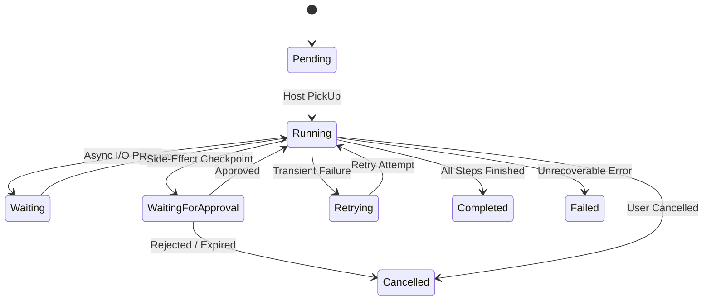
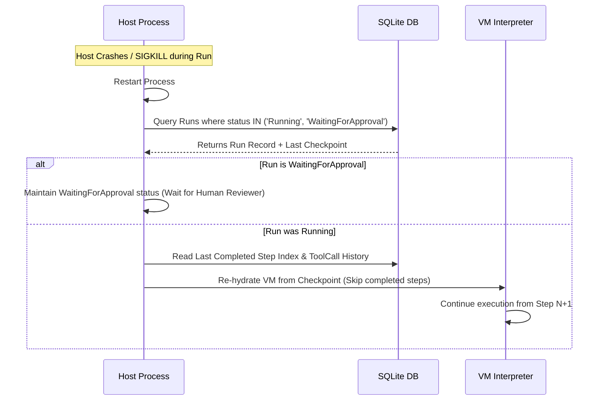

# Kitwork Agent Runtime — Run Execution Lifecycle

This document specifies the state transitions, restart recovery mechanisms, side-effect safety strategies, and cancellation propagation for Agent Runs.

---

## 1. Run State Machine Diagram

---

## 2. State Transition & Authorization Table

| Source State | Destination State | Trigger Event | Authorized Actor | Persistence Requirement |
|---|---|---|---|---|
| `[*] ` | `Pending` | Agent Run Created | User API / Cron Scheduler | SQLite Commit (`agent_runs`) |
| `Pending` | `Running` | Worker Pool Leases Run | Host Runtime Engine | SQLite Update (`status = 'Running'`) |
| `Running` | `WaitingForApproval` | Step encounters `Publication` side-effect skill | VM Step Executor | SQLite Commit (`Checkpoint` + `Approval`) |
| `WaitingForApproval` | `Running` | Human reviewer submits approval token | Reviewer API | SQLite Update (`Approval.status = 'Approved'`) |
| `WaitingForApproval` | `Cancelled` | Human reviewer rejects token / timeout | Reviewer API / Cron Purge | SQLite Update (`Approval.status = 'Rejected'`) |
| `Running` | `Retrying` | Step throws retryable error | Host Runtime Engine | SQLite Update (`status = 'Retrying'`) |
| `Running` | `Completed` | Final Step completes cleanly | Host Runtime Engine | SQLite Update (`status = 'Completed'`) |
| `Running` | `Failed` | Hard VM error or MaxEnergy exceeded | Host Runtime Engine | SQLite Update (`status = 'Failed'`) |
| `Running` | `Cancelled` | User issues cancellation request | User API | SQLite Update (`status = 'Cancelled'`) |

---

## 3. Process Restart & Side-Effect Recovery Protocol

### Side-Effect Recovery Strategy
If a tool call executed an external side effect (e.g. sent a webhook or created a draft) before a host process crash occurred:
1. Every ToolCall records a deterministic `idempotency_key` (`run_id:step_index:tool_name`).
2. On process restart, the Host Runtime checks the `agent_tool_calls` table.
3. If a tool call record exists with `status = 'Completed'`, the result is replayed from SQLite without re-invoking the external tool API.
