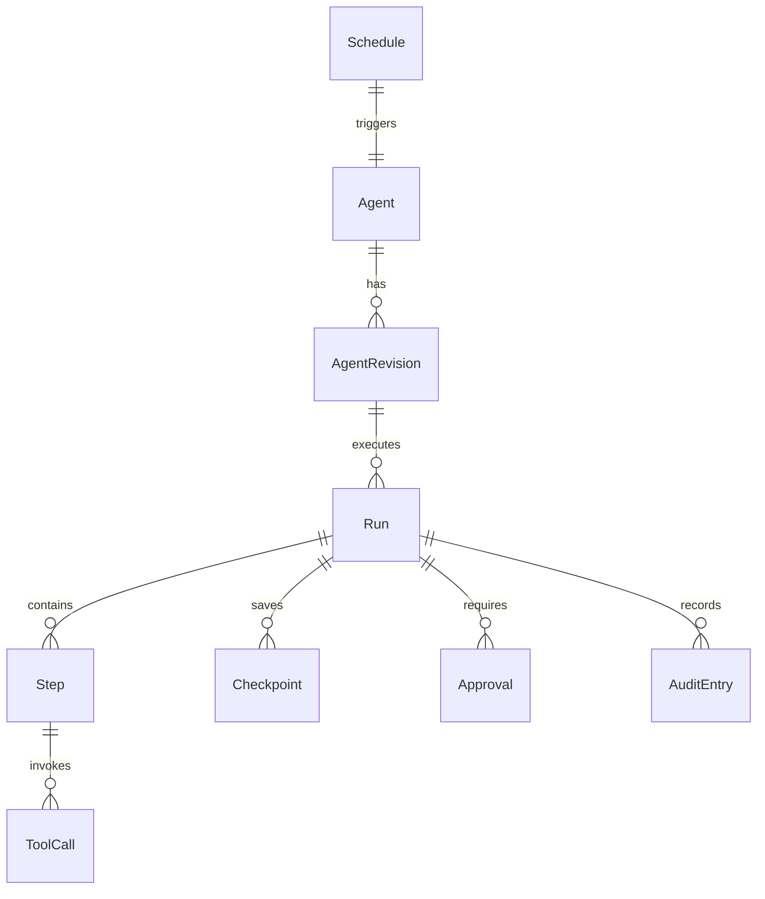

# Kitwork Agent Runtime — Domain Model Specification

This document defines the core domain entities, lifecycles, persistence rules, tenant ownership, and idempotency guarantees for the Kitwork Agent Runtime.

---

## 1. Entity Relationship Diagram

---

## 2. Entity Specifications

### 1. `Agent`
- **Responsibility**: Top-level definition of an autonomous agent entity.
- **State**: `active`, `paused`, `archived`.
- **Tenant Ownership**: Strict `TenantID` ownership.
- **Persistence**: SQLite database table `agents`.
- **Fields**: `id`, `tenant_id`, `slug`, `name`, `description`, `created_at`, `updated_at`.

### 2. `AgentRevision`
- **Responsibility**: Immutable version snapshot of an agent's code, prompt templates, and skill declarations.
- **State**: Immutable after creation.
- **Persistence**: SQLite database table `agent_revisions`.
- **Fields**: `id`, `agent_id`, `revision_number`, `bytecode_hash`, `manifest_json`, `created_at`.

### 3. `Run`
- **Responsibility**: Represents a single execution instance of an agent revision.
- **State**: `Pending` -> `Running` -> `Waiting` -> `WaitingForApproval` -> `Retrying` -> `Completed` / `Failed` / `Cancelled`.
- **Persistence**: SQLite database table `agent_runs`.
- **Fields**: `id`, `tenant_id`, `agent_id`, `revision_id`, `status`, `input_json`, `output_json`, `error_detail`, `started_at`, `ended_at`.

### 4. `Step`
- **Responsibility**: Individual execution unit within a Run.
- **State**: `Pending` -> `Running` -> `Completed` / `Failed`.
- **Persistence**: SQLite database table `agent_steps`.
- **Idempotency**: Keyed by `idempotency_key` (`run_id:step_index`).
- **Fields**: `id`, `run_id`, `step_index`, `name`, `status`, `input_data`, `output_data`, `idempotency_key`, `started_at`, `completed_at`.

### 5. `Event`
- **Responsibility**: Incoming event trigger in an agent's inbox.
- **State**: `Queued` -> `Processing` -> `Processed` / `DeadLetter`.
- **Persistence**: SQLite database table `agent_events`.
- **Fields**: `id`, `tenant_id`, `topic`, `payload_json`, `created_at`, `processed_at`.

### 6. `Schedule`
- **Responsibility**: Cron trigger for recurring agent runs.
- **State**: `Active`, `Paused`.
- **Persistence**: SQLite database table `agent_schedules`.
- **Fields**: `id`, `agent_id`, `cron_expression`, `next_run_at`, `enabled`.

### 7. `Checkpoint`
- **Responsibility**: Serialized memory state snapshot enabling process recovery.
- **Persistence**: SQLite database table `agent_checkpoints`.
- **Retention**: Retain last 5 checkpoints per Run; auto-purge on Run completion.
- **Fields**: `id`, `run_id`, `step_index`, `state_snapshot_json`, `saved_at`.

### 8. `Approval`
- **Responsibility**: Human-in-the-loop approval request for side-effect skills.
- **State**: `Pending` -> `Approved` / `Rejected` / `Expired`.
- **Persistence**: SQLite database table `agent_approvals`.
- **Fields**: `id`, `run_id`, `step_index`, `token`, `status`, `requested_at`, `responded_at`, `reviewer_note`.

### 9. `Skill`
- **Responsibility**: Declarative specification of an executable capability tool.
- **Persistence**: In-memory registry loaded from Application manifest.
- **Fields**: `name`, `version`, `description`, `side_effect_class`, `timeout_ms`, `requires_approval`.

### 10. `ToolCall`
- **Responsibility**: Record of a skill tool invocation within a Step.
- **Persistence**: SQLite database table `agent_tool_calls`.
- **Fields**: `id`, `step_id`, `skill_name`, `params_json`, `result_json`, `duration_ms`.

### 11. `ResourceBudget`
- **Responsibility**: Execution energy and time limits.
- **Fields**: `MaxEnergy` (opcodes), `MaxDurationMs`, `MaxToolCalls`.

### 12. `AuditEntry`
- **Responsibility**: Immutable security audit trail of all side-effect actions.
- **Persistence**: SQLite database table `agent_audit_log` (Append-only).
- **Fields**: `id`, `tenant_id`, `run_id`, `step_id`, `action`, `actor`, `timestamp`, `detail_json`.
