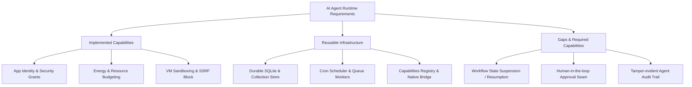

# Kitwork Engine — Agent Runtime Readiness Assessment

This document evaluates the architectural readiness of the Kitwork Engine as an execution environment for autonomous AI Agents requiring identity, durable state, tool execution, scheduling, resource budgeting, and long-running workflows.

---

## 1. Component Capability Matrix for AI Agents

---

## 2. Readiness Audit by Feature Dimension

| Feature Area | Current Engine Status | Existing / Reusable Component | Gaps & Missing Features | Architectural Owning Layer |
|---|---|---|---|---|
| **Identity & Scope** | **Production Ready** | `app.Runtime`, `work.Entity`, `request.Scope` | Needs agent-specific identity tokens (Agent ID vs User Principal). | Host & App Layer |
| **Durable State** | **Production Ready** | `persist.Store`, `db.sqlite.go`, `collection.go` | Vector database / embedding storage integration missing. | App Layer |
| **Tool Execution** | **Production Ready** | `capabilities.Registry`, `value.NativeFunc`, SSRF Guard | Standardized Model Context Protocol (MCP) or tool-calling schema translation. | Host Capability Layer |
| **Resource Budgeting** | **Production Ready** | `runtime.VM.MaxEnergy`, instruction counting | Token usage metering (LLM token count tracking parallel to energy metering). | VM & Host Layer |
| **Scheduling** | **Production Ready** | `work.CronScheduler`, `work.QueueWorker` | Priority queueing for time-sensitive agent tool triggers. | App Layer |
| **Isolation** | **Production Ready** | Verified bytecode VM, zero-allocation VM pool, `ResetForPool` | Memory bounds per VM instance (currently process memory is shared). | VM Layer |
| **Retry & Timeout** | **Partially Implemented** | HTTP retry policy, `Context.WithTimeout()` | Exponential backoff engine for external agent tool calls. | Capability Layer |
| **Long-Running Workflows** | **Gaps Identified** | `kitwork().go(fn)` background task tracking | **Missing**: VM continuation state suspension/resumption across host process restarts. | Engine / VM Layer |
| **Human Approval** | **Gaps Identified** | Request context authorization hooks | **Missing**: Workflow pause-and-resume opcode or async approval callback boundary. | App / Workflow Layer |
| **Audit Logging** | **Partially Implemented** | `RuntimeHealth`, structured `slog` execution logs | **Missing**: Cryptographic, tamper-evident audit log for agent decision traces. | Host & Storage Layer |

---

## 3. Architecture Recommendations for Agent Workflows

To evolve Kitwork into a first-class AI Agent runtime without cluttering the core Virtual Machine:

### 1. What Should Remain in the VM Layer
- Energy/gas metering (`MaxEnergy`).
- Strict subset execution (arrow functions, zero `while` loops to guarantee non-blocking tool steps).
- Sandbox verification and opcode isolation.

### 2. What Should Belong to the Host Runtime Layer
- Agent tool registration via `capabilities.Registry`.
- SSRF protection and external API rate-limiting for agent web access.
- System-wide agent event dispatching and queue workers.

### 3. What Should Belong to the Application / Framework Layer
- Agent state machine definitions, prompt templates, and conversation memory.
- Human approval workflows (storing pending approval tickets in SQLite).
- LLM provider integration adapters (OpenAI, Anthropic, Gemini API callers).
