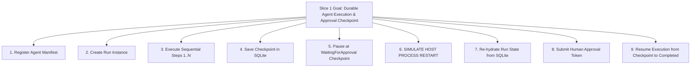

# Kitwork Agent Runtime — Vertical Slice 1 Specification

This document specifies the exact scope, implementation strategy, database schemas, public APIs, and test plan for **Vertical Slice 1** of the Kitwork Agent Runtime.

---

## 1. Slice 1 Goals & Scope Boundary



### In-Scope for Slice 1
- Declarative Agent Registration in Host Runtime.
- SQLite-backed state persistence for `agents`, `agent_runs`, `agent_steps`, `agent_checkpoints`, and `agent_approvals`.
- Sequential step execution using deterministic fake skills.
- Automatic Run pause when encountering `requires_approval: true`.
- Real process restart re-hydration test (`TestAgentRuntimeSlice1ProcessRestart`).
- Execution timeline logging.

### Out-of-Scope for Slice 1 (Deferred to Slice 2+)
- Real external LLM Provider API calls (uses deterministic fake skills).
- Complex Web UI Console (uses HTTP REST JSON endpoints).
- Multi-node agent cluster distribution.

---

## 2. Target Files & Schemas

### Files to Create / Modify
- [NEW] [engine/work/agent_runtime.go](file:///d:/project/kitwork/engine/work/agent_runtime.go) — Host Agent Runtime manager.
- [NEW] [engine/work/agent_store.go](file:///d:/project/kitwork/engine/work/agent_store.go) — SQLite state persistence store for agent entities.
- [NEW] [engine/work/agent_runtime_test.go](file:///d:/project/kitwork/engine/work/agent_runtime_test.go) — Integration test suite for Slice 1.

### Database Schema SQL
```sql
CREATE TABLE IF NOT EXISTS agent_runs (
    id TEXT PRIMARY KEY,
    tenant_id TEXT NOT NULL,
    agent_id TEXT NOT NULL,
    status TEXT NOT NULL, -- Pending, Running, WaitingForApproval, Completed, Failed, Cancelled
    current_step_index INTEGER NOT NULL DEFAULT 0,
    input_json TEXT,
    output_json TEXT,
    created_at TIMESTAMP DEFAULT CURRENT_TIMESTAMP,
    updated_at TIMESTAMP DEFAULT CURRENT_TIMESTAMP
);

CREATE TABLE IF NOT EXISTS agent_checkpoints (
    id TEXT PRIMARY KEY,
    run_id TEXT NOT NULL,
    step_index INTEGER NOT NULL,
    snapshot_json TEXT NOT NULL,
    created_at TIMESTAMP DEFAULT CURRENT_TIMESTAMP,
    FOREIGN KEY(run_id) REFERENCES agent_runs(id)
);

CREATE TABLE IF NOT EXISTS agent_approvals (
    id TEXT PRIMARY KEY,
    run_id TEXT NOT NULL,
    step_index INTEGER NOT NULL,
    approval_token TEXT UNIQUE NOT NULL,
    status TEXT NOT NULL DEFAULT 'pending', -- pending, approved, rejected
    requested_at TIMESTAMP DEFAULT CURRENT_TIMESTAMP,
    responded_at TIMESTAMP,
    FOREIGN KEY(run_id) REFERENCES agent_runs(id)
);
```

---

## 3. Minimal Public & Internal APIs

### Public Host Go API (`work.AgentRuntime`)
```go
type AgentRuntime struct { ... }

// NewAgentRuntime initializes the agent runtime on a tenant database
func NewAgentRuntime(db *sql.DB, tenantID string) *AgentRuntime

// RegisterAgent registers an agent manifest
func (ar *AgentRuntime) RegisterAgent(agent AgentManifest) error

// CreateRun starts a new run instance for an agent
func (ar *AgentRuntime) CreateRun(agentID string, input map[string]any) (*Run, error)

// SubmitApproval submits a human approval or rejection token
func (ar *AgentRuntime) SubmitApproval(token string, approve bool, notes string) error

// GetRunTimeline returns the step execution timeline for a run
func (ar *AgentRuntime) GetRunTimeline(runID string) ([]StepLog, error)
```

---

## 4. Completion Criteria & Verification

1. `go test -v ./work -run TestAgentRuntimeSlice1ProcessRestart` passes cleanly.
2. The test verifies that killing the Host instance while a Run is `WaitingForApproval`, re-instantiating `NewAgentRuntime`, and calling `SubmitApproval(token, true, "Looks good")` resumes the Run from the exact step checkpoint and sets `status = 'Completed'`.
