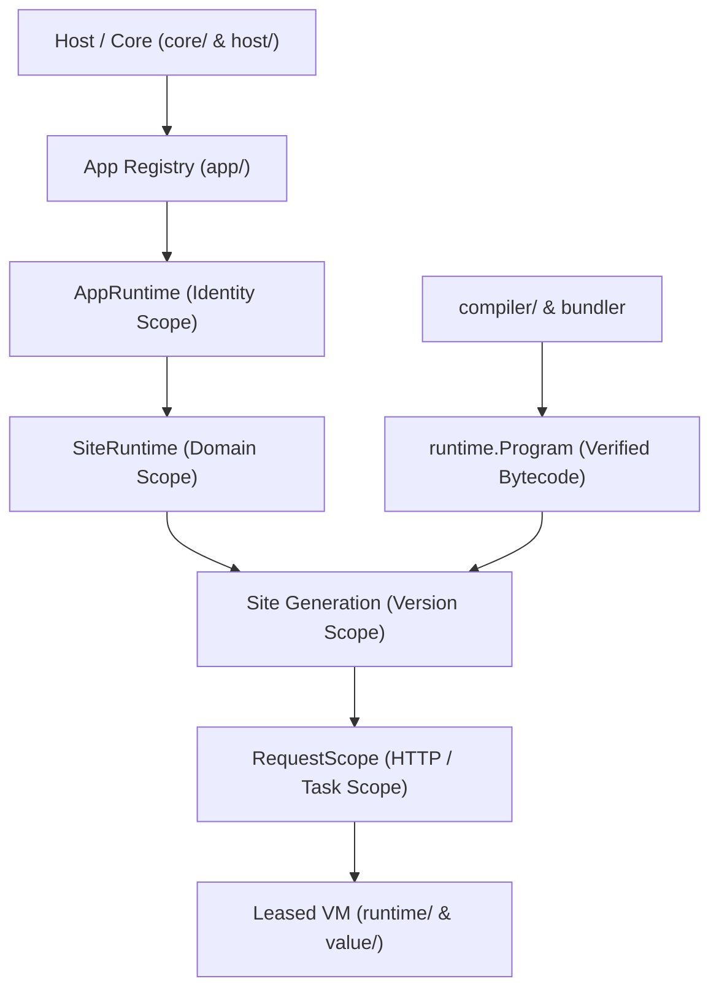

# Kitwork Engine — Architecture Overview

## 1. Executive Summary & Design Philosophy
Kitwork is a high-performance, sovereign multi-tenant execution runtime written in Go. Instead of embedding v8 or a heavyweight JavaScript runtime, Kitwork implements a custom hand-written stack-based Virtual Machine (VM) running a strictly constrained, statically analyzable JavaScript subset.

The engine relies on a **Zero-VM / Zero-Allocation** principle where possible: static assets are served directly from disk via zero-copy I/O (`io.Copy`), while executable JavaScript logic is compiled down to compact bytecode, verified prior to publication, and executed inside reusable VM pools.

---

## 2. Package Map & Architectural Boundaries



### Primary Packages and Responsibilities

| Package | Key Path | Architectural Role & Responsibilities | Boundary & Constraints |
|---|---|---|---|
| **Core** | [engine/core](file:///d:/project/kitwork/engine/core/engine.go) | Process host (`core.Engine`), HTTP listener dispatch, tenant discovery, hot reload orchestration, rate limiting (`RateLimiter`), idle eviction loop (`cleanupLoop`). | Manages process lifecycle. Does not execute bytecode directly. |
| **App** | [engine/app](file:///d:/project/kitwork/engine/app/application.go) | Identity-scoped runtime (`app.Runtime`), identity background task tracking (`tasks.go`), database connection manager (`database.go`), identity scheduler host. | Scoped to an tenant identity (`apps/<identity>/`). Does not track HTTP request state. |
| **Site** | [engine/site](file:///d:/project/kitwork/engine/site/generation.go) | Domain runtime (`site.Runtime`) and atomic generation manager (`site.Generation`). Owns persistent response caches, SSE broker connections, rate limit budgets, and source manifest fingerprinting. | Scoped to a domain (`<domain>/`). Manages generation publication and request drain. |
| **Request** | [engine/request](file:///d:/project/kitwork/engine/request/scope.go) | HTTP request lifetime manager (`request.Scope`). Manages cancellation contexts, authentication principal/permissions, request-scoped capability caches, primary VM leases, and child VM leases. | Created per HTTP request. Released immediately after response header write or SSE stream start. |
| **Compiler** | [engine/compiler](file:///d:/project/kitwork/engine/compiler/compiler.go) | Lexer (`lexer.go`), Parser (`parser.go`), AST definitions (`ast.go`), Native Import Bundler (`bundler.go`), Bytecode Generator (`compiler.go`), and Bytecode File Cache (`cache.go`, `artifact.go`). | Lowers JS subset source into bytecode + constants. Enforces language subset rules (no `while`/`try-catch`, arrow-only functions). |
| **Runtime** | [engine/runtime](file:///d:/project/kitwork/engine/runtime/vm.go) | Stack-based Interpreter (`interpreter.go`), Bytecode Verifier (`verify.go`), Program container (`program.go`), Instruction metadata (`instruction.go`), Energy/Gas metering (`energy.go`), Diagnostic formatter (`diagnostic.go`). | Standalone execution unit. Accepts verified `*runtime.Program` only. Recycles VMs via `FastReset` / `ResetForPool`. |
| **Value** | [engine/value](file:///d:/project/kitwork/engine/value/value.go) | 24-byte NaN-boxed/tagged union `Value` type ([value.go](file:///d:/project/kitwork/engine/value/value.go)), Kind classification ([kind.go](file:///d:/project/kitwork/engine/value/kind.go)), Dynamic Prototype Methods ([methods.go](file:///d:/project/kitwork/engine/value/methods.go)), Proxy Engine ([proxy.go](file:///d:/project/kitwork/engine/value/proxy.go)), Result Reshaper ([result.go](file:///d:/project/kitwork/engine/value/result.go)). | Core data representation across Compiler, VM, and Native Bridge. |
| **Work** | [engine/work](file:///d:/project/kitwork/engine/work/tenant.go) | Execution facade (`Tenant`), Filesystem Router (`router_tree.go`, `router_folder.go`, `router_serve.go`), DB query builder (`db.go`, `db.sqlite.go`), Cron Scheduler (`cron.go`), Job Queue (`queue.go`), Background Worker (`go.go`), SSE Broker (`sse.go`). | Bridges Go host capabilities to JS VM global bindings. |
| **Capabilities** | [engine/capabilities](file:///d:/project/kitwork/engine/capabilities/registry.go) | Dependency Injection & Service Registry (`registry.go`), Capability Lifetime Manager (Transient, Request, Site, App, Singleton). | Controls access to system capabilities based on request identity permissions. |
| **Render** | [engine/render](file:///d:/project/kitwork/engine/render/render.go) | High-performance HTML view template engine (`render.go`), Template Snapshot manager (`snapshot.go`). | Pre-parses and renders `{{ }}` expressions and layouts without disk reads on hot path. |
| **JIT** | [engine/jit](file:///d:/project/kitwork/engine/jit/) | On-demand JIT engines for CSS ([jit.go](file:///d:/project/kitwork/engine/jit/css/jit.go)), Icons ([icons.go](file:///d:/project/kitwork/engine/jit/icons/icons.go)), Logos ([logo.go](file:///d:/project/kitwork/engine/jit/logo/logo.go)), Theme ([theme.go](file:///d:/project/kitwork/engine/jit/theme/theme.go)), Hydrate/KitJS ([render.go](file:///d:/project/kitwork/engine/jit/hydrate/render.go)). | Intercepts HTML/CSS streams to generate minimal, zero-unused CSS/JS runtime assets on the fly. |

---

## 3. Subsystem Breakdown

### 3.1 Lexer, Parser & Compiler Pipeline
- **Lexer ([lexer.go](file:///d:/project/kitwork/engine/compiler/lexer.go))**: Converts raw JS text into tokens. Features O(1) character classification tables, string interning for keywords/operators, and zero-allocation slice parsing using `sync.Pool`.
- **Parser ([parser.go](file:///d:/project/kitwork/engine/compiler/parser.go))**: Pratt-style parser enforcing the Kitwork JS subset:
  - Banned syntax: `while`, `do-while`, `for(;;) unlimited`, `try-catch-finally`, `class`, `this`, standard `function` declarations (arrow functions `() => {}` only).
  - Special rules: Trailing commas in array literals strictly rejected; parenthesized object returns required (`() => ({})`).
- **Bundler ([bundler.go](file:///d:/project/kitwork/engine/compiler/bundler.go))**: Native import bundler replacing external toolchains (esbuild). Resolves relative `./` imports, detects cycles, and wraps each module in an IIFE (`const __kw_mod_N = (() => { ... return { exports }; })();`).
- **Compiler ([compiler.go](file:///d:/project/kitwork/engine/compiler/compiler.go))**: Lowers AST nodes directly into stack opcodes (`PUSH`, `LOAD`, `STORE`, `CALL`, `INVOKE`, `ITER`, `COMMIT`). Emits a `DebugEntry` on source location transitions for precise stack traces.

### 3.2 Bytecode & VM Architecture
- **Opcode Specification ([instruction.go](file:///d:/project/kitwork/engine/runtime/instruction.go))**: `InstructionSpec` defines canonical opcode properties (numeric byte code, name, operand width, fixed/dynamic stack delta, energy cost).
- **Verifier ([verify.go](file:///d:/project/kitwork/engine/runtime/verify.go))**: Pre-publication 4-pass verification on `*runtime.Program`. Validates instruction bounds, constant types, jump targets, stack depth consistency across branches, and lambda entry boundaries.
- **VM Engine ([vm.go](file:///d:/project/kitwork/engine/runtime/vm.go) & [interpreter.go](file:///d:/project/kitwork/engine/runtime/interpreter.go))**:
  - Stack: Fixed-capacity slice of 24-byte `Value` items.
  - Call Frames: Pre-allocated array of `Frame` structs. Frame variables (`f.Vars`) resolve locally before falling back to closure scope (`fn.Scope`), root frame (`vm.Vars`), and global builtins (`vm.Globals`).
  - Closure Capture: Setting `frame.captured = true` prevents recycling `f.Vars` map when returning from a function that created an escaping lambda.
  - FastReset: Recycles VM instances by clearing stack, frames, and variable maps without re-allocating VM structures.

### 3.3 Runtime & Tenant Isolation Model
- **App Engine Hierarchy**: `Host -> AppRuntime(identity) -> SiteRuntime(domain) -> Generation(version)`.
- **Tenant Facade ([tenant.go](file:///d:/project/kitwork/engine/work/tenant.go))**: Bridges incoming requests to compiled site generation routes.
- **Resource Ownership**:
  - `AppRuntime`: Database connections, cron background scheduler, detached background task pools (`kitwork().go()`), app capabilities (`LifetimeApp`).
  - `SiteRuntime`: Disk-persisted response cache, SSE broker connections, rate limit budgets.
  - `Generation`: Prepared filesystem route tree (`RouteTree`), HTML template snapshots (`RenderPlan`), per-generation RAM response cache, site capabilities (`LifetimeSite`).
  - `RequestScope`: Request-scoped capability cache (`LifetimeRequest`), VM lease (`enginePool`).

### 3.4 Router & Execution Framework
- **Filesystem Route Tree ([router_tree.go](file:///d:/project/kitwork/engine/work/router_tree.go) & [router_folder.go](file:///d:/project/kitwork/engine/work/router_folder.go))**: Maps requested URLs to folder nodes in `apps/<identity>/<domain>/app/`.
- **Folder Lifecycle**:
  - Route execution walks outside-in through folder hierarchy (`/` -> `/blog` -> `/blog/[slug]`).
  - Each folder executes its own `router.kitwork.js` bytecode. `vm.FastResetPrepared` resets the VM to the folder's `*runtime.Program` before executing its guards/middleware.
  - Visual output: Renders nested HTML layouts (`_layout_.kitwork.html`) inside-out upon completion of leaf handlers.

---

## 4. Architectural Boundaries Summary

```text
[ Process Boundary (core.Engine) ]
   └── [ App Identity Sandbox (app.Runtime) ] ── (DB Pool, Cron, Tasks, App Caps)
         └── [ Domain Sandbox (site.Runtime) ] ── (SSE Broker, Rate Limits, Disk Cache)
               └── [ Version Generation (site.Generation) ] ── (Route Tree, HTML Snapshot, VM Bytecode)
                     └── [ Request Scope (request.Scope) ] ── (VM Lease, Cancellation Context)
```
