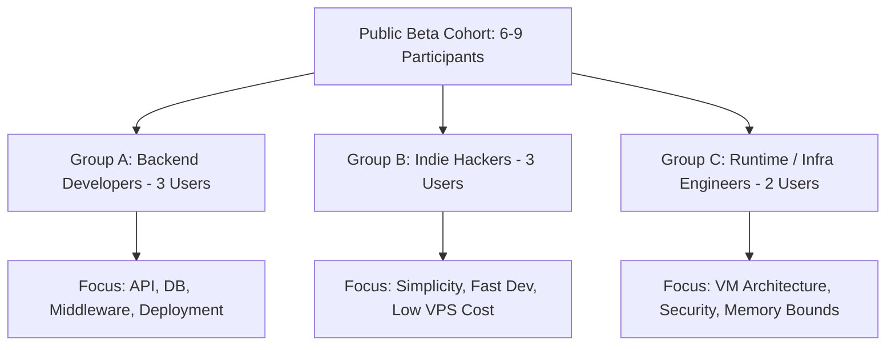

# Kitwork Engine — Beta Participant Profile & Selection Criteria

This document defines the participant selection criteria, user cohort profiles, minimum knowledge prerequisites, bias filtering, and feedback triage rules for the Public Beta cohort.

---

## 1. Beta Cohort Profiles



### Detailed Participant Criteria

| Persona Group | Target Background | Minimum Required Knowledge | Biases to Filter Out | Target Cohort Count |
|---|---|---|---|---|
| **Group A: Backend Developer** | 2+ years Go, Node.js, or Python backend experience. Builds REST APIs. | Basic HTTP, JSON, SQL concepts, terminal navigation. | Reject assumptions that every runtime must support full npm/Node.js C++ modules. | **3 Users** |
| **Group B: Indie Hacker** | Solo developer building small SaaS, micro-tools, or web apps. | HTML, basic JS, VPS hosting (`systemd`/`ssh`). | Reject requests for heavy GUI CMS features out of scope for a runtime. | **3 Users** |
| **Group C: Infra / Systems Engineer** | Systems engineer, compiler hobbyist, or DevOps engineer. | C/Go memory models, virtual machines, sandboxing. | Reject micro-optimization requests that compromise Go stdlib-only simplicity. | **2-3 Users** |

---

## 2. Participant Selection & Screening Rules

### Mandatory Selection Criteria
- Must have Go 1.22+ installed on their development machine (Windows, macOS, or Linux).
- Must have built at least one web application or HTTP API service previously.
- Must agree to complete all 8 beta tasks without direct assistance from the author during active testing.

### Biases to Avoid
- Avoid recruiting only personal friends or team members who know Kitwork's internal architecture.
- Avoid participants who insist on using complex Kubernetes / microservice infrastructure for single-page applications.

---

## 3. Feedback Classification Methodology

To prevent personal preferences from diluting actionable engine feedback, all feedback items will be triaged using the **Common Pattern vs. Personal Preference Matrix**:

```text
[ Feedback Classification Filter ]
  ├── 1. Blocker Bug: Multiple users fail same task -> Immediate Fix
  ├── 2. Documentation Gap: User checks engine source code -> Fix Documentation
  ├── 3. Error Message Ambiguity: User spends > 3m on parse error -> Improve Diagnostic
  └── 4. Personal Preference: Single user requests syntax change -> Log in DX Backlog (Nice-to-Have)
```
