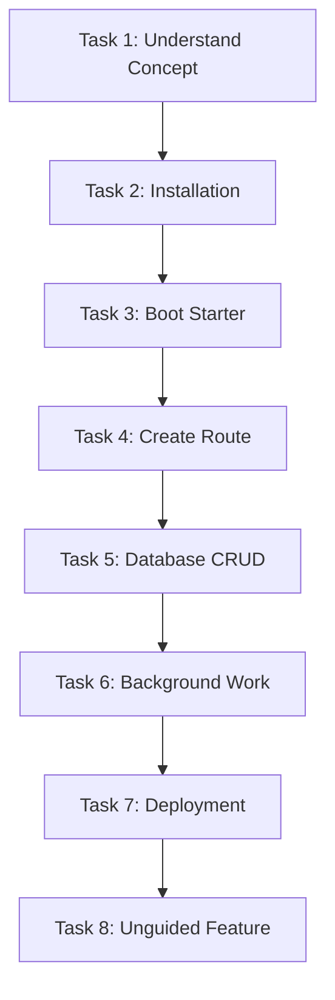

# Kitwork Engine — Beta User Task Suite

This document defines the 8 standardized hands-on tasks that every Public Beta participant must perform independently.

---

## 1. Task Suite Overview

---

## 2. Detailed Task Specifications

### Task 1: Project Comprehension
- **Goal**: Read the `README.MD` and explain Kitwork's architecture and target use cases in own words.
- **Entry Condition**: Participant receives repository URL or documentation link.
- **Completion Criteria**: Writes 3-sentence summary of Kitwork and identifies 2 valid use cases.
- **Expected Duration**: 5 minutes.
- **Allowed Assistance**: None (self-guided reading).
- **Observable Behaviors**: Reading speed, sections paused on, questions asked about JS subset or CGO.
- **Answers to Withhold**: Do not explain multi-tenancy or VM internals verbally; let docs explain.

---

### Task 2: Environment & Installation
- **Goal**: Install Go 1.22+ (if missing) and verify Kitwork CLI preflight binary toolchain.
- **Entry Condition**: Task 1 complete.
- **Completion Criteria**: Executes `go run . check` or `kitwork version` with clean `0` exit code.
- **Expected Duration**: 3 minutes.
- **Allowed Assistance**: None.
- **Observable Behaviors**: OS terminal errors, path configuration issues.
- **Answers to Withhold**: Do not explain environment variable setup unless `.env` docs fail.

---

### Task 3: Booting the Starter Project
- **Goal**: Boot the `kitwork-starter` application locally and open the homepage in a browser.
- **Entry Condition**: Task 2 complete.
- **Completion Criteria**: Browser loads `http://localhost:8080` displaying HTTP `200 OK` page.
- **Expected Duration**: 2 minutes.
- **Allowed Assistance**: None.
- **Observable Behaviors**: Confusing `ALLOW_LOCAL=true` requirement or port conflict handling.
- **Answers to Withhold**: Do not tell participant about `ALLOW_LOCAL=true` if they omit `.env`.

---

### Task 4: Creating a Dynamic Parameter Route
- **Goal**: Add a route `/users/[id]` returning JSON `{ id: params.id, name: "User " + params.id }` and handle missing ID validation.
- **Entry Condition**: Task 3 complete.
- **Completion Criteria**: `curl http://localhost:8080/users/42` returns JSON; invalid request returns 400.
- **Expected Duration**: 5 minutes.
- **Allowed Assistance**: None.
- **Observable Behaviors**: Attempting to use banned syntax (`function` keyword or `while` loop).
- **Answers to Withhold**: Do not correct JS subset syntax errors verbally; let compiler error display.

---

### Task 5: Database Querying & Mutation
- **Goal**: Create table `items`, insert a row, query it by ID using `ctx.db.table("items")`, and handle 404 for missing items.
- **Entry Condition**: Task 4 complete.
- **Completion Criteria**: Successful insert and fetch via HTTP endpoint; missing item returns 404.
- **Expected Duration**: 8 minutes.
- **Allowed Assistance**: None.
- **Observable Behaviors**: Attempting `.update()` without `.where()`, expecting ORM models.
- **Answers to Withhold**: Do not explain mandatory `.where()` rules; let DB guard error display.

---

### Task 6: Background Task Execution
- **Goal**: Register a background job using `kitwork().go(fn)` or `_cron` scheduler and verify execution log.
- **Entry Condition**: Task 5 complete.
- **Completion Criteria**: Task executes in background without blocking HTTP response; log confirms execution.
- **Expected Duration**: 7 minutes.
- **Allowed Assistance**: None.
- **Observable Behaviors**: Attempting to pass request context variables into background worker.
- **Answers to Withhold**: Do not explain worker lifetime bounds verbally.

---

### Task 7: Application Build & Deployment
- **Goal**: Configure environment variables, build binary or container, and run app on a non-local port/server.
- **Entry Condition**: Task 6 complete.
- **Completion Criteria**: `GET /health` endpoint on target deployment returns `200 OK`.
- **Expected Duration**: 15 minutes.
- **Allowed Assistance**: Standard deployment documentation provided.
- **Observable Behaviors**: Directory volume mount issues for SQLite databases, environment secret loading.
- **Answers to Withhold**: Do not fix deployment script errors for tester.

---

### Task 8: Unguided Feature Addition
- **Goal**: Add a rate-limited endpoint `POST /api/feedback` with IP rate limiting without step-by-step guidance.
- **Entry Condition**: Tasks 1-7 complete.
- **Completion Criteria**: Endpoint works; exceeding rate limit returns HTTP 429 Too Many Requests.
- **Expected Duration**: 10 minutes.
- **Allowed Assistance**: API reference docs only.
- **Observable Behaviors**: Mental model comprehension, searching docs vs guessing API syntax.
- **Answers to Withhold**: Do not provide code snippets.
