# Kitwork Engine — Developer Journey Specification

This document maps out the complete end-to-end user journey for a developer building applications with Kitwork, specifying what the user needs to know, required tools, commands, file edits, common pitfalls, and missing documentation at every stage.

---

## 1. Developer Journey Mapping Matrix

```mermaid
graph LR
    Discover[1. Discover] --> Install[2. Install]
    Install --> Init[3. Create Project]
    Init --> LocalDev[4. Local Dev]
    LocalDev --> Routes[5. Add Routes]
    Routes --> DB[6. Add DB]
    DB --> Error[7. Error Handling]
    Error --> Background[8. Background Tasks]
    Background --> Test[9. Testing]
    Test --> Deploy[10. Deployment]
```

### Detailed Stage Breakdown

| Stage | Developer Goal | Required Tools & Knowledge | Command / Action | Files Modified | Common Pitfalls & Errors | Documentation Seams |
|---|---|---|---|---|---|---|
| **1. Discover** | Understand what Kitwork is and why to use it. | Concept of Go-based sovereign JS runtime, zero-CGO, multi-tenancy. | Reads `README.MD` / GitHub repo page. | None | Confusing Kitwork with Node.js/Next.js or Docker containers. | Needs clear comparison page ("Kitwork vs Docker vs V8"). |
| **2. Install** | Set up local machine to run Kitwork applications. | Go 1.22+ installed. | `go install github.com/kitwork/kitwork@latest` | `.env` file | Forgetting `ALLOW_LOCAL=true` in `.env` causes AutoSSL ACME errors. | Document `ALLOW_LOCAL=true` in Quickstart banner. |
| **3. Create Project** | Initialize a new Kitwork application directory. | Kitwork project conventions (`router.kitwork.js`, `page.kitwork.html`). | `kitwork init myapp.localhost` | `apps/tenant/myapp.localhost/...` | Manual directory creation mistakes. | Need `kitwork init` CLI command. |
| **4. Local Dev** | Start the development server with hot reload. | HTTP port configuration, hot reload behaviors. | `go run .` or `kitwork dev` | `router.kitwork.js`, `.env` | Port conflict if 8080 is in use. | Document `PORT=8090` override. |
| **5. Add Routes** | Create HTTP GET/POST endpoints and render HTML views. | Kitwork JS subset rules (arrow functions, parenthesized returns). | Writes route module and page view. | `app/blog/router.kitwork.js`, `app/blog/page.kitwork.html` | Using `function name()` or `while` loop triggers Parse Error. | Cheatsheet for JS subset syntax rules. |
| **6. Add DB** | Perform CRUD queries against SQLite database. | Parameterized queries via `ctx.db.table()`. | `ctx.db.table("users").where("id", id).first()` | `router.kitwork.js` | Calling `.update()` without `.where()` throws hard runtime error. | Query builder API reference card. |
| **7. Error Handling** | Handle 404s, query failures, and validation errors. | `.safe()` inline error handling, `ctx.status()`. | `const res = query.safe()` | `router.kitwork.js` | Expecting `try/catch` to work (banned at parser level). | Dedicated error handling guide. |
| **8. Background Tasks** | Run cron jobs and background tasks. | `kitwork().go(fn)`, `work.CronScheduler`. | `kitwork().go(() => { ... })` | `_cron/job.kitwork.js` | Attempting to access request-scoped variables in background task. | Background task scope lifetime rules. |
| **9. Testing** | Verify application routes prior to deployment. | `kitwork check` preflight validator tool. | `go run . check` | `*.kitwork.js` | Preflight failing due to relative import path typo. | Document preflight error codes. |
| **10. Deployment** | Deploy application to production server. | Systemd service or Docker container setup. | `docker run -p 80:8080 kitwork/engine` | `Dockerfile`, `systemd.service` | Forgetting host directory volume mounts for persistent SQLite databases. | Production deployment guide. |
