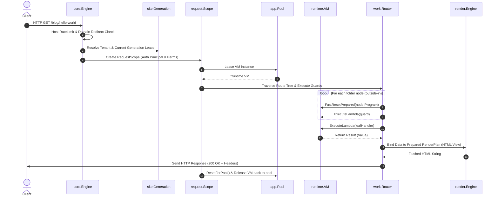

# Kitwork Engine — Execution Lifecycle

## 1. End-to-End Execution Flow

This document details the exact sequence of events from when a Kitwork JavaScript file is read from disk to when an HTTP response is returned to the client and resources are returned to their respective pools.



---

## 2. Phase-by-Phase Technical Walkthrough

### Phase 1: Source Discovery & Reading
1. `core.Engine.ServeHTTP` extracts the HTTP `Host` header and matches it against cached site runtimes.
2. If the domain is not yet compiled or hot reload detects source file modifications (`Generation.Sources().Changed()`), the host triggers `prepareGeneration`.
3. Source files (`router.kitwork.js`, `page.kitwork.html`, relative native imports `./lib/db.js`) are read from disk.

### Phase 2: Lexing & Parsing
1. `compiler.NewLexerSource(input, filename)` tokenizes input text. Identifiers and keywords are converted to `compiler.Token` structs.
2. `compiler.Parse(lexer)` builds an AST (`compiler.BlockStatement`).
3. Parser strictly validates syntax subset rules:
   - Rejects `while`, `try-catch`, `class`, `this`, and standard `function` statements.
   - Verifies array literal syntax (rejecting trailing commas `[1, 2,]`).
   - Ensures object-returning arrow functions are parenthesized `() => ({ key: val })`.

### Phase 3: Native Import Bundling & Bytecode Compilation
1. **Bundler**: If the AST contains relative imports (`import { helper } from "./helper.js"`), `compiler.nativeBundle` resolves dependency trees, detects circular references, wraps modules into IIFE modules, and rewrites imports into variable bindings.
2. **Compiler**: `compiler.CompileAST(ast)` generates instruction bytes (`[]byte`) and a constant pool (`[]value.Value`).
3. Stack opcodes (`PUSH`, `LOAD`, `STORE`, `CALL`, `INVOKE`, `ITER`, `COMMIT`) are appended with 16-bit big-endian constant/jump indices.
4. **Verification**: `runtime.NewProgramWithDebug` performs a 4-pass verifier check (`runtime.Verify`) to guarantee stack safety, valid jump targets, and opcode boundaries prior to execution.

### Phase 4: Bytecode Storage & Caching
1. Successful compilation yields a `*runtime.Program` bundled into a `*compiler.Bytecode`.
2. **RAM Storage**: The `*compiler.Bytecode` is stored inside `site.Generation`'s `RouteTree` nodes.
3. **Disk Cache**: If `bytecodeCache: true` is enabled in `app.web`, `compiler.FileCache` serializes verified programs using `Program.MarshalBinary` with cryptographic source fingerprints (SHA-256) into `.kitwork/cache/bytecode/`.

### Phase 5: Request Scope & VM Leasing
1. `core.Engine.ServeHTTP` initializes a `request.Scope` attached to `http.Request.Context()`.
2. Host middleware executes `Authorizer` to attach an immutable authenticated principal and permission grant.
3. `requestScope.LeaseVM` acquires a clean `*runtime.VM` from `app.Pool`.
4. `prepareExecutionVM` sets global bindings: `vm.Globals["kitwork"]`, `vm.Globals["env"]`, `vm.MaxEnergy`, and context cancellation listeners.

### Phase 6: Opcode Execution Loop
1. `runtime.VM.execute(floor)` runs the single interpreter loop:
   ```go
   for vm.FrameIdx >= floor {
       op := Opcode(vm.program.code[frame.IP])
       frame.IP++
       spec := &instructionTable[uint8(op)]
       if !vm.consumeEnergy(spec.Energy) { ... }
       if vm.instructions & 63 == 0 { checkContextCancellation() }
       switch op { ... }
   }
   ```
2. Opcode execution consumes energy from `MaxEnergy`. If energy hits zero, execution halts immediately with `DiagnosticEnergyLimit`.

### Phase 7: Variable Resolution & Closure Management
1. **Variable Lookup (`LOAD`)**:
   - Checks active frame local map `f.Vars`.
   - Walks lexical closure chain `lookupScopeChain(f.Fn, name)` via `fn.Scope`.
   - Checks top-level module scope `vm.Vars` (Frame 0).
   - Checks global builtins `vm.Globals`.
2. **Closure Capture (`PUSH` lambda constant)**:
   - Creates a `*value.Lambda` capturing `frame.Vars` by reference as `closure.Scope`.
   - Sets `frame.captured = true`.
   - When `frame` exits, `prepareLambdaFrame` sees `captured == true` and allocates a fresh map for subsequent frame reuses, preserving the captured map for the escaping closure.

### Phase 8: Function Calls & Native Bridge Invocations
1. **JS Function Call (`CALL`)**:
   - Pops arguments and function target.
   - Pushes a new `Frame` onto `vm.Frames`, sets `frame.IP = lambda.Address`, binds parameter values into `frame.Vars`.
2. **Native Method Call (`INVOKE`)**:
   - Pops method name, argument count `n`, arguments, and target `Value`.
   - Invokes `target.Invoke(name, args)`:
     - If `target` is a `Proxy`, invokes `proxy.OnInvoke`.
     - Checks target `Kind.Method` dispatch table.
     - Calls native Go function/reflection adapter inside `nativeAction`, wrapping panics into `NATIVE_PANIC` diagnostics.

### Phase 9: Route Matching & Layout Rendering
1. `RouteTree.Resolve(r.URL.Path)` matches URL segments to filesystem route nodes.
2. Guards walk outside-in (`/` -> `/blog` -> `/blog/[slug]`). Before each node executes, `vm.FastResetPrepared(node.Program)` switches VM code pointers to the node's compiled program.
3. Leaf handler returns a `Value` or calls `ctx.view(data)`.
4. Deferred view rendering builds HTML using `site.Generation`'s `RenderPlan` and `render.Snapshot`. Layouts (`_layout_.kitwork.html`) wrap child page partials inside-out without disk reads.

### Phase 10: Response Transmission & Resource Recycling
1. HTTP headers (e.g. `X-Request-ID`, `Content-Type`) and status code are written to `http.ResponseWriter`.
2. The HTML or JSON payload is written to the client stream.
3. **VM Recycling**:
   - `requestScope.ReleaseVM()` invokes `vm.ResetForPool()`.
   - Stack slice is reset to zero length (`vm.Stack = vm.Stack[:0]`).
   - Frame stack is reset (`vm.FrameIdx = -1`).
   - Frame variable maps and defer arrays are cleared.
   - Detached captured scopes remain safely referenced by lambdas while the VM returns to `app.Pool`.
