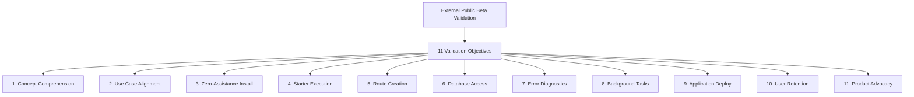

# Kitwork Engine — External Validation Goals & Metrics

This document defines the quantitative metrics and qualitative validation goals for testing Kitwork with external developers during the Public Beta phase.

---

## 1. Core Validation Objectives

---

## 2. Measurable Evaluation Criteria

| Goal # | Validation Question | Measurable Target Metric | Evaluation Method | Success Threshold |
|---|---|---|---|---|
| **G1** | Do new developers understand what Kitwork is? | Time to explain Kitwork accurately in their own words. | Post-read interview / survey. | **< 3 minutes** reading README. |
| **G2** | Do they understand which apps Kitwork is suited for? | Identification accuracy of target use cases (SaaS, AI Agent, multi-tenant). | Scenario identification test. | **> 80% accuracy** (distinguishes VPS vs Docker vs V8). |
| **G3** | Can they install Kitwork without asking for help? | Zero support requests during installation. | Screen recording / log audit. | **100% autonomous install** on Go 1.22+. |
| **G4** | Can they boot the starter project cleanly? | Time from git clone to first `200 OK` response. | Timed task observation. | **< 2 minutes**. |
| **G5** | Can they write their first route and return JSON/HTML? | Time to create a custom dynamic parameter route. | Task completion observation. | **< 5 minutes**. |
| **G6** | Can they perform database CRUD queries using `ctx.db`? | Successful query/mutation without reading Go engine code. | Code inspection & execution test. | **> 90% success rate** on first attempt. |
| **G7** | Do they understand compiler & VM error messages? | Correct resolution of syntax and parse errors without author help. | Error scenario recovery test. | **< 3 minutes** to fix a parse error. |
| **G8** | Can they execute background jobs or cron schedulers? | Verified execution of `_cron` or `kitwork().go` task. | Log verification. | **> 85% completion rate**. |
| **G9** | Can they deploy the app to a remote server/VPS? | Successful deployment with operational `/health` endpoint. | Remote deployment audit. | **< 15 minutes**. |
| **G10** | Do they want to continue using Kitwork after trial? | Post-trial continuation interest rating. | 1-to-5 Likert scale survey. | **Score >= 4.0 out of 5**. |
| **G11** | Can they explain Kitwork's architecture to others? | Ability to describe zero-CGO Go VM multi-tenancy. | Verbal summary evaluation. | **Clear explanation without major inaccuracies**. |
