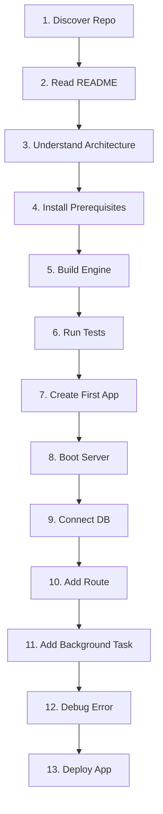

# Kitwork Engine — First-User Experience (FX) Audit

This document audits the first-time developer experience (FX) of Kitwork, simulating the exact step-by-step onboarding flow of a developer discovering Kitwork for the first time without prior internal engine knowledge.

---

## 1. Developer Onboarding Audit Matrix

### Step-by-Step Experience Friction Audit

| Step | Developer Action | Friction Rating | Friction Points Identified | Required Fix / Recommendation |
|---|---|---|---|---|
| **1. Discover Repo** | Views GitHub root directory. | **Low** | Clear directory layout, AGENTS.md present. | None. |
| **2. Read README** | Reads `README.MD` in root. | **Medium** | Mixes engine core facts with application framework concepts. | Restructure README to emphasize "Fast Sovereign Multi-Tenant Go Runtime for JS". |
| **3. Understand Architecture** | Reads `docs/ARCHITECTURE.md`. | **High** | `ARCHITECTURE.md` still describes outdated `index.kitwork.js` loader structure instead of production tree routing (`router.kitwork.js` + `page.kitwork.html`). | Add prominent disclaimer and update `ARCHITECTURE.md` to reflect production filesystem routing. |
| **4. Install Tools** | Installs Go toolchain. | **Low** | Requires standard Go 1.22+. Zero CGO or npm/v8 dependencies. | State Go 1.22+ requirement explicitly in README. |
| **5. Build Project** | Runs `go build .` in root. | **Low** | Compiles clean `kitwork.exe` in ~3 seconds. | None. Excellent. |
| **6. Run Tests** | Runs `go test ./...`. | **Medium** | `go test ./...` in root tests host wrapper. To test engine core, user must know to `cd engine && go test ./...`. | Add top-level `Makefile` or `scripts/test.sh` bridging root and `engine/` tests. |
| **7. Create First App** | Creates a new site folder. | **High** | Folder structure (`apps/<identity>/<domain>/...`) requires specific naming rules. If identity is missing, single-tenant path resolution rules kick in (`sites/<domain>`). | Provide `kitwork init <domain>` CLI command to generate boilerplate site layout automatically. |
| **8. Boot Server** | Runs `go run .` | **Low** | Server boots on `:8080` (or `PORT=...`). `ALLOW_LOCAL=true` skips ACME. | Document `ALLOW_LOCAL=true` environment variable prominently in quickstart guide. |
| **9. Connect DB** | Uses `ctx.db` in route. | **Low** | `ctx.db.table("name")` automatically opens per-tenant SQLite database. | Great DX. |
| **10. Add Route** | Creates `app/hello/page.kitwork.html`. | **Medium** | User must understand layout bubbling (`_layout_.kitwork.html`) and view binding (`{{ .message }}`). | Provide clear view binding cheatsheet in docs. |
| **11. Add Background Task** | Uses `kitwork().go(fn)`. | **Medium** | User does not know if background task survives host restart. | Document task durability boundaries. |
| **12. Debug Error** | Syntax error in script. | **Medium** | Error log shows structured line/column, but `kitwork check` doesn't print code snippet around error. | Enhance `kitwork check` output to display 3-line code context snippet around syntax error. |
| **13. Deploy App** | Triess deploying to VPS. | **High** | No default `Dockerfile` or systemd service template provided in repository. | Add `deploy/` directory containing `Dockerfile` and `systemd.service` template. |

---

## 2. Key Developer Friction Findings

1. **Stale Documentation Discrepancy**:
   - A developer reading `ARCHITECTURE.md` will attempt to write `index.kitwork.js` inside an `app/` subfolder.
   - The production engine actually looks for `router.kitwork.js` and `page.kitwork.html`.
   - **Impact**: Developer gets 404 errors immediately.
2. **Implicit Local Dev Flag (`ALLOW_LOCAL=true`)**:
   - Running `go run .` without `ALLOW_LOCAL=true` in `.env` attempts to initialize AutoSSL / ACME certificates against Let's Encrypt, failing on local development machines without a public IP.
   - **Impact**: Immediate crash on initial local run unless `.env` is properly populated.
3. **Sub-repo Test Confusion**:
   - Running `go test ./...` in the root workspace folder only executes host canary tests.
   - The engine core lives in `engine/` (a separate sub-repository). Running `go test ./...` from root omits 95% of engine tests.
   - **Impact**: Developers believe tests are passing when they haven't executed the engine test suite.
