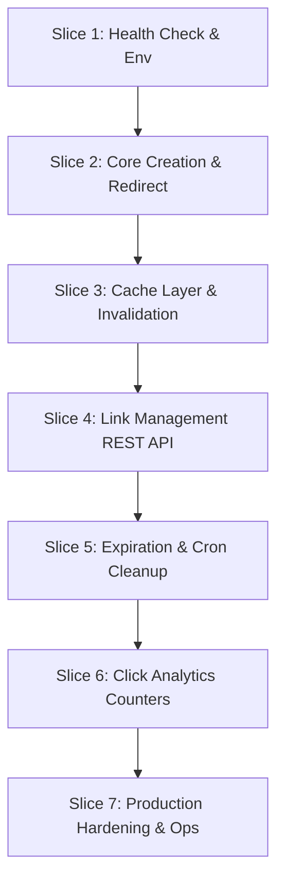

# KitURL — Vertical Slice Implementation Plan

This document outlines the 7 vertical slice implementation increments for building and deploying KitURL on Kitwork Engine.

---

## 1. Implementation Overview & Vertical Slices

---

## 2. Detailed Vertical Slice Specifications

### Slice 1: Health Check & Environment Scaffolding
- **Observable Outcome**: Server boots, loads `.env`, logs startup, and `GET /health` returns `200 OK` with JSON `{ status: "ok", service: "KitURL" }`.
- **Files Created**:
  - `apps/0123456789abcdefghijklmnopqrstuvwxyz/kiturl.localhost/config.kitwork.yaml`
  - `apps/0123456789abcdefghijklmnopqrstuvwxyz/kiturl.localhost/.env`
  - `apps/0123456789abcdefghijklmnopqrstuvwxyz/kiturl.localhost/router.kitwork.js`
  - `apps/0123456789abcdefghijklmnopqrstuvwxyz/kiturl.localhost/app/health/router.kitwork.js`
- **Tests Needed**: Integration test asserting HTTP GET `/health` status `200` and valid JSON payload.
- **Completion Criteria**: `go run . check` passes clean; `curl http://localhost:8080/health` returns `200 OK`.
- **Engine Modification Required**: **No**.

---

### Slice 2: Core Link Creation & HTTP Redirection
- **Observable Outcome**: API user posts `{ url: "https://example.com" }` to `POST /api/v1/links`, receives `{ code: "a1b2c3d4", short_url: "..." }`. Navigating browser to `GET /a1b2c3d4` redirects to `https://example.com` with `301 Moved Permanently`.
- **Files Created**:
  - `apps/0123456789abcdefghijklmnopqrstuvwxyz/kiturl.localhost/app/api/v1/links/router.kitwork.js`
  - `apps/0123456789abcdefghijklmnopqrstuvwxyz/kiturl.localhost/app/[code]/router.kitwork.js`
- **Tests Needed**: End-to-end unit test creating a link, verifying unique slug generation, and executing HTTP GET redirect.
- **Completion Criteria**: Successful creation and redirect flow with 100% test pass.
- **Engine Modification Required**: **No**.

---

### Slice 3: Response & Link Caching Layer
- **Observable Outcome**: Repeated redirects for hot links serve from Kitwork RAM cache without hitting SQLite database.
- **Files Created/Modified**:
  - Add `.cache("5m")` directive to `app/[code]/router.kitwork.js`.
- **Tests Needed**: Cache hit assertion test verifying fast response times and zero DB queries on hit.
- **Completion Criteria**: Cache hits verified under benchmark test.
- **Engine Modification Required**: **No**.

---

### Slice 4: Link Management REST API
- **Observable Outcome**: API user can list links (`GET /api/v1/links`), update target or active status (`PATCH /api/v1/links/:id`), and delete/archive links (`DELETE /api/v1/links/:id`).
- **Files Created**:
  - `apps/0123456789abcdefghijklmnopqrstuvwxyz/kiturl.localhost/app/api/v1/links/[id]/router.kitwork.js`
- **Tests Needed**: CRUD integration test verifying link listing, status updating, and deletion.
- **Completion Criteria**: All CRUD endpoints operational and tested.
- **Engine Modification Required**: **No**.

---

### Slice 5: Link Expiration & Cron Cleanup Worker
- **Observable Outcome**: Links with `expires_at < NOW` return `410 Gone` on redirect attempts. `_cron/cleanup.kitwork.js` runs every 10 minutes to purge/archive expired records.
- **Files Created**:
  - `apps/0123456789abcdefghijklmnopqrstuvwxyz/kiturl.localhost/_cron/cleanup.kitwork.js`
- **Tests Needed**: Cron execution test asserting expired links are flagged/purged automatically.
- **Completion Criteria**: Expired link redirection returns `410`; cron cleanup executes reliably.
- **Engine Modification Required**: **No**.

---

### Slice 6: Analytics & Detached Click Counters
- **Observable Outcome**: Redirections increment `access_count` and update `last_accessed_at` in background via `kitwork().go(fn)` without blocking HTTP redirect responses.
- **Files Modified**:
  - Update `app/[code]/router.kitwork.js` to dispatch detached counter increment worker.
- **Tests Needed**: Concurrency test asserting 100 parallel redirects result in `access_count == 100`.
- **Completion Criteria**: Counter accurately reflects click totals under parallel request stress.
- **Engine Modification Required**: **No**.

---

### Slice 7: Production Hardening & Operational Runbooks
- **Observable Outcome**: Host and route rate limits enforced (`router.ratelimit`), database backup/restore verified, operational runbooks written.
- **Files Created**:
  - `scripts/backup-kiturl.sh`
  - `scripts/restore-kiturl.sh`
- **Tests Needed**: Rate limit rejection test (HTTP 429) under flood traffic.
- **Completion Criteria**: Production checklist satisfied; zero unhandled errors under load test.
- **Engine Modification Required**: **No**.
