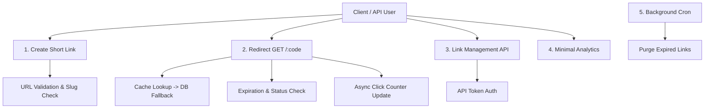

# KitURL — MVP Product Scope Specification

KitURL is a high-performance, production-grade URL shortener service built on top of the Kitwork Engine. This document defines the minimal viable product (MVP) scope, explicit feature inclusions, and strict exclusion boundaries.

---

## 1. Core Principles & Philosophy
- **Dogfooding Reality**: KitURL operates as a standalone production service serving real users, proving Kitwork Engine's capabilities under real-world traffic.
- **Engine Minimal Touch**: KitURL uses existing Kitwork Engine APIs. Engine modifications are permitted only if a critical blocker is empirically proven.
- **Vertical Slice Increments**: Features are delivered end-to-end (database -> router -> view/API -> tests) in vertical slices.

---

## 2. In-Scope MVP Capabilities

### Feature Inclusion Matrix

| Feature | Description | MVP Requirement |
|---|---|---|
| **Short Link Creation** | Generate 8-character shortbase links (`id.Shortlink()`). | **Mandatory** |
| **URL Redirect** | Fast HTTP 301/302 redirection from `GET /:code` to destination URL. | **Mandatory** |
| **Custom Slugs** | Allow users to supply custom alias slugs (e.g. `GET /my-custom-link`). | **Mandatory** |
| **Link Expiration** | Optional `expires_at` timestamp. Expired links return 410 Gone. | **Mandatory** |
| **Active / Disabled Toggle** | Admin status toggle (`active: true/false`). Disabled links return 404/410. | **Mandatory** |
| **Click Counter & Timestamp** | Increment `access_count` and update `last_accessed_at` on redirect. | **Mandatory** |
| **Management API** | REST API (`GET /api/v1/links`, `PATCH /api/v1/links/:id`, `DELETE /api/v1/links/:id`). | **Mandatory** |
| **URL Validation** | Strictly validate destination URL format and block loopback/private IPs. | **Mandatory** |
| **Rate Limiting** | Host and folder rate limiting (e.g., 10 creations/min per IP, 1000 redirects/min). | **Mandatory** |
| **Health Check & Metrics** | `GET /health` endpoint returning database and engine status. | **Mandatory** |
| **Background Cleanup Job** | App-owned `_cron/cleanup.kitwork.js` purging or archiving expired links. | **Mandatory** |
| **Backup & Restore** | SQLite database backup and restore scripts. | **Mandatory** |

---

## 3. Explicit Out-of-Scope Items for MVP

The following features are **strictly excluded** from the MVP to maintain focus on runtime correctness, dogfooding quality, and performance:

- ❌ Billing & Payment Gateways (Stripe/PayPal integrations)
- ❌ Complex Multi-User Team Roles & RBAC (Basic API Token auth only)
- ❌ AI / LLM Link Summarization
- ❌ Affiliate Marketing Engine
- ❌ Deep Geographic / Device User Tracking (Only click counts & timestamps)
- ❌ Complex Graphical Analytics Dashboards
- ❌ Microservices / Distributed Message Queues (Built on single Kitwork Go host process)
