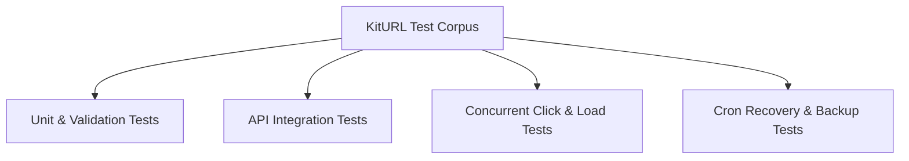

# KitURL — Quality Assurance & Testing Plan

This document specifies the complete quality assurance test plan for KitURL, covering unit, integration, concurrency, cache, resilience, and load testing.

---

## 1. Test Suite Coverage Matrix



### Test Case Specifications

| Category | Test Case Name | Target Component | Input Condition | Expected Behavior | Target Test File |
|---|---|---|---|---|---|
| **Validation** | `TestValidShortLinkCreation` | `POST /api/v1/links` | Valid URL `https://kitwork.io` | Returns 201 Created + 8-char shortcode. | `kiturl_api_test.go` |
| **Validation** | `TestInvalidURLRejection` | `POST /api/v1/links` | Invalid URL `not-a-url` | Returns 400 Bad Request + error message. | `kiturl_api_test.go` |
| **Validation** | `TestDuplicateSlugCollision` | `POST /api/v1/links` | Duplicate slug `"my-slug"` | Returns 409 Conflict + collision error. | `kiturl_api_test.go` |
| **Routing** | `TestNonExistentSlugRedirect` | `GET /missing1` | Non-existent shortcode | Returns 404 Not Found HTML/JSON. | `kiturl_redirect_test.go` |
| **Routing** | `TestDisabledLinkRedirect` | `GET /code` | Link with `active: false` | Returns 410 Gone / 404 Not Found. | `kiturl_redirect_test.go` |
| **Routing** | `TestExpiredLinkRedirect` | `GET /code` | Link with `expires_at < NOW` | Returns 410 Gone + expired message. | `kiturl_redirect_test.go` |
| **Cache** | `TestCacheHitBypassesDB` | `GET /hotcode` | Repeated GET requests | Second request hits RAM cache; 0 DB queries. | `kiturl_cache_test.go` |
| **Cache** | `TestCacheInvalidationOnUpdate` | `PATCH /api/v1/links/:id` | Update link target while cached | Cache cleared; next GET reads updated target. | `kiturl_cache_test.go` |
| **Concurrency** | `TestConcurrentClickCounters` | `GET /code` | 100 parallel GET requests | `access_count` increments to exactly 100. | `kiturl_race_test.go` |
| **Resilience** | `TestCronCleanupPurgesExpired` | `_cron/cleanup.js` | Database with 10 expired links | Cron job purges expired records; logs count. | `kiturl_cron_test.go` |
| **Ops** | `TestBackupAndRestoreIntegrity` | `scripts/backup.sh` | Backup DB, drop table, restore | Restored DB has identical link rows. | `kiturl_ops_test.go` |

---

## 2. Automated Test Commands

```bash
# 1. Run all KitURL integration tests
go test ./apps/0123456789abcdefghijklmnopqrstuvwxyz/kiturl.localhost/... -v

# 2. Run with race detector
go test -race ./apps/0123456789abcdefghijklmnopqrstuvwxyz/kiturl.localhost/...

# 3. Preflight static check
go run . check
```
