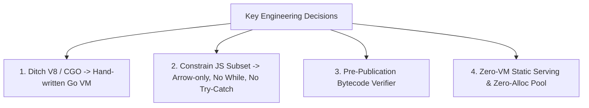

# Kitwork — The Core Story: Building a Sovereign Go VM Runtime

This document captures the authentic, deep technical narrative of Kitwork, explaining why a solo developer spent nearly a year building a custom JavaScript compiler and VM in Go.

---

## 1. The Core Problem & Motivation

### Why Kitwork Exists
Modern web hosting and application platforms force a painful trade-off:
- **Containers (Docker/Kubernetes)**: Provide strict OS isolation, but carry heavy RAM overhead (100MB+ per container), slow cold boot times (seconds), and complex orchestration for running hundreds of small, isolated sites or tenants on a single VPS.
- **Node.js / V8 Runtimes**: Fast execution, but multi-tenancy inside a single Node.js process is unsafe due to shared global prototypes, memory leaks, and lack of per-tenant CPU/gas bounds. Embedding V8 requires CGO, breaking cross-compilation and creating massive binary dependencies.

Kitwork was built to solve one specific problem:
> **How to run hundreds of isolated, secure, stateful web applications and AI agents inside a single Go process with near-zero RAM overhead, instant startup, and zero CGO dependencies.**

---

## 2. Key Architectural Decisions & Trade-offs

### 1. Ditching V8 & CGO for a Hand-written Go VM
Rather than importing V8 or CGO bindings, Kitwork implements a 24-byte NaN-boxed/tagged union stack VM in standard Go library code. This keeps the binary self-contained (~14MB), compiles in seconds, and cross-compiles cleanly to Windows, Linux, and macOS without C toolchains.

### 2. The Language Subset as the Security Model
Executing user scripts inside a shared process is dangerous. Kitwork solves security through language constraints:
- **No `while` or `do-while` loops**: Eliminates non-terminating CPU loops at the parser level.
- **No `try-catch`**: Prevents swallowed errors and ensures explicit result handling (`.safe()`).
- **Arrow functions only (`() => {}`)**: Eliminates complex prototype inheritance bugs, `this` binding context ambiguity, and prototype pollution.
- **Opcode Energy Accounting (`MaxEnergy`)**: Every bytecode instruction consumes gas energy, halting runaway computations deterministically.

### 3. "One Process, Many Isolated Systems"
Instead of spawning N OS processes or containers, Kitwork organizes execution around a 4-tier hierarchy:
`Host -> AppRuntime(identity) -> SiteRuntime(domain) -> Generation(version) -> RequestScope(HTTP request)`.
Sister sites share database pools and background schedulers safely without memory leakage or cross-tenant data access.

---

## 3. Engineering Failures & Architectural Pivots

### Pivot 1: Dropping esbuild for a Native Go Module Bundler
Early prototypes relied on calling external `esbuild` binaries for module resolution. This broke the "single binary" philosophy and introduced external file dependencies. Kitwork replaced esbuild with an AST-level native bundler (`compiler.nativeBundle`) that resolves relative imports into self-executing IIFE modules in pure Go.

### Pivot 2: From Flat Routers to Filesystem Route Trees
Initial versions used central `app.kitwork.js` route mapping files. Feedback demonstrated that developers prefer Next.js-style filesystem routing. Kitwork migrated to a filesystem route tree (`router.kitwork.js` and `page.kitwork.html`), compiling folder nodes into immutable `RouteTree` graphs.

---

## 4. Who Kitwork Is and Isn't For

### Kitwork is Ideal for:
- Developers self-hosting 10 to 500+ isolated sites or SaaS tenant apps on a single $10/mo VPS.
- Engineers building stateful AI agents requiring durable SQLite memory, tool execution sandboxes, and gas budgeting.
- Teams wanting single-binary deployments without Docker/Kubernetes cluster overhead.

### Kitwork is NOT for:
- Projects requiring full Node.js npm ecosystem compatibility or heavy C++ native modules.
- Codebases relying on legacy ES5 class hierarchies or complex `try/catch` exception control flow.
