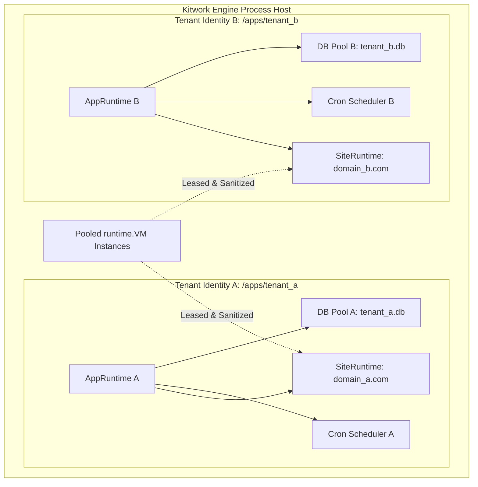

# Kitwork Engine — Security & Isolation Model

This document evaluates the multi-tenant isolation model of the Kitwork Engine, analyzes potential data/resource leak vectors, and establishes a realistic threat model for sovereign process hosting.

---

## 1. Multi-Tenant Isolation Architecture

### Isolation Guarantees & Boundaries

| Resource Dimension | Isolation Boundary | Enforcement Mechanism | Failure/Leak Risk |
|---|---|---|---|
| **VM State** | Request / Lease Boundary | `runtime.VM.ResetForPool()` clears frames, stack slices, variables, and defers before returning VM to `app.Pool`. | **Low**. Protected by retention soak tests ([retention_soak_test.go](file:///d:/project/kitwork/engine/runtime/retention_soak_test.go)). |
| **Filesystem / Storage** | Tenant Folder Boundary | `filepath.Join(root, identity, domain)` enforces path scoping. Direct file access checked by `safepath`. Static serving restricted to `/public/`. | **Low**. Handler/capsule JS source files (`*.kitwork.js`) are never served statically. |
| **Database Connections** | Identity (`app.Runtime`) | SQLite connections keyed by canonical path but owned by identity `app.Runtime`. Sister domains under same identity share DB connections; different identities get separate connections. | **Low**. Enforced by identity-scoped entity builder (`work.Entity`). |
| **Environment Secrets** | Generation Boundary | `.env` loaded once into immutable `site.Generation` snapshot. System environment variables (`PATH`, `HOST`, `USER`) stripped from script `env` proxy. | **Low**. Scoped per generation. |
| **Network & Outbound HTTP** | Process / SSRF Firewall | Outbound HTTP requests routed through `utilities/http` with SSRF protection blocking private IP ranges (`127.0.0.1`, `10.0.0.0/8`, `192.168.0.0/16`, AWS IMDS `169.254.169.254`). | **Medium**. SSRF blocking must apply to all DNS resolves. |
| **CPU / Energy Budget** | VM Dispatch Boundary | `MaxEnergy` decrements on every instruction. Context cancellation checked every 64 opcodes. | **Low**. Prevents infinite loops (`while` is banned at parser level anyway). |

---

## 2. Leak Point Audit

### 2.1 Global State Leaks
- **Risk**: Process-global Go variables or package-level singletons retaining tenant data across requests.
- **Audit Findings**:
  - `vm.Globals` stores builtins (`kitwork`, `env`, `Math`, `Date`, `JSON`). These are immutable scalar/function references shared safely across tenants.
  - Per-tenant state is injected into `vm.Vars` or `request.Scope`.
  - Reusable backing arrays in `value.Value` maps are detached during `ResetForPool()`.

### 2.2 Escaped Closures & Captured Frame Maps
- **Risk**: A long-lived global callback or event listener retaining an escaped lambda scope map from a completed HTTP request.
- **Audit Findings**:
  - `vm.go` sets `frame.captured = true` when a closure is instantiated, preventing frame map recycling.
  - While this prevents data corruption, it means captured variables remain in memory as long as the closure object is referenced.

### 2.3 Error Stack & Telemetry Leakage
- **Risk**: Error stack traces or failure diagnostics revealing host path structures (`d:\project\kitwork\...`) or internal database credentials to external clients.
- **Audit Findings**:
  - `runtime.Diagnostic` formats structured errors with source line/column.
  - In production mode (`AllowLocal == false`), internal Go panics return generic `500 Internal Server Error` to client HTTP responses while writing detailed diagnostics to private host logs (`slog`).

---

## 3. Kitwork Threat Model

### Threat Actor 1: Malicious Tenant Code (Untrusted Script Author)
- **Goal**: Read host environment variables, access other tenant SQLite databases on disk, execute infinite loops, or trigger host process crashes.
- **Mitigation**:
  - Language subset strictly bans `while`, `try-catch`, `class`, arbitrary reflection, and `eval`.
  - VM energy metering halts runaway scripts.
  - File system access restricted to tenant folder; system OS env vars filtered out of `env` object.

### Threat Actor 2: Client Request Manipulation (SSRF & Path Traversal)
- **Goal**: Supply crafted URL paths (`/../../_cron/secret`) or trigger outbound HTTP requests to internal cloud metadata endpoints (`169.254.169.254`).
- **Mitigation**:
  - Router normalizes URL paths using `path.Clean` prior to route matching.
  - Outbound HTTP capability enforces strict SSRF checks against loopback, RFC1918 private IPs, and cloud metadata addresses.

### Threat Actor 3: Resource Exhaustion (DoS Flood)
- **Goal**: Exhaust host VM pool memory or DB connection limits through high-concurrency requests.
- **Mitigation**:
  - `core.RateLimiter` drops excess requests at the host boundary prior to tenant resolution.
  - Request VM leases enforce max energy limits and request timeout context cancellations.
