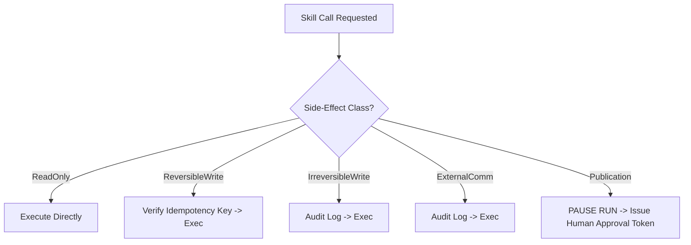

# Kitwork Agent Runtime — Skill Contract & Side-Effect Classification

This document specifies the declarative Skill Contract, side-effect classifications, and human approval checkpoint requirements.

---

## 1. Skill Declaration Schema

Every skill registered in the Kitwork Agent Runtime must conform to the following contract specification:

```json
{
  "name": "withai.newsroom.publish_article",
  "version": "1.0.0",
  "description": "Publishes an approved news article to WithAI.vn CMS",
  "side_effect_class": "Publication",
  "requires_approval": true,
  "timeout_ms": 10000,
  "retry_policy": {
    "max_attempts": 3,
    "backoff_factor": 2.0
  },
  "required_permissions": ["cms.write"],
  "required_secrets": ["WITHAI_CMS_API_KEY"],
  "audit_required": true
}
```

---

## 2. Side-Effect Classification Taxonomy



### Taxonomy Rules

| Side-Effect Class | Definition | Auto-Retry Safe? | Human Approval Required? | Example Skill |
|---|---|---|---|---|
| `ReadOnly` | Reads data without mutating any state. | **Yes** | **No** | Fetch RSS Feed, Search Database, Query LLM. |
| `ReversibleWrite` | Mutates state but can be rolled back or overwritten. | **Yes (with Idempotency Key)** | **No** | Create Draft Record, Save Local Cache. |
| `IrreversibleWrite` | Mutates state permanently (cannot be undone automatically). | **No (Requires Key)** | Optional | Delete Archive Record, Deduplicate Table. |
| `ExternalComm` | Communicates with external third-party systems. | **No** | Optional | Send Slack Alert, Post Webhook Notification. |
| `Publication` | Publishes content publicly (WithAI.vn article release). | **No** | **STRICTLY MANDATORY** | Publish Article to CMS, Tweet Final Post. |

---

## 3. Mandatory Human Approval Rule for Publication Skills

> **CRITICAL RULE**: Any skill tagged with `side_effect_class: "Publication"` or `requires_approval: true` **MUST** automatically pause the Run at state `WaitingForApproval`. The runtime **CANNOT** invoke the publication skill until an explicit approval token is signed and submitted by a human reviewer.
