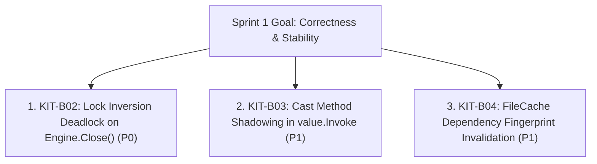

# Kitwork Engine — Sprint 1 Plan

This plan defines the exact scope, execution order, test-driven methodology, and safety bounds for **Stabilization Sprint 1**.

---

## 1. Selected Sprint Scope & Prioritization Rationale

Per the strict prioritization rules (1. Tenant isolation / state leak -> 2. Race condition, deadlock -> 3. Worker reuse -> 4. Wrong result returned -> 5. Panic/invalid bytecode -> 6. Scheduler -> 7. Stale cache -> 8. API inconsistency), Sprint 1 targets **three high-impact, fully confirmed issues**:



### Selection Summary

| ID | Title | Priority | Category | Selection Rationale | Target Package / File |
|---|---|---|---|---|---|
| **KIT-B02** | Lock Inversion Deadlock on `Engine.Close()` | **P0** | Concurrency / Deadlock | Rule 2: Deadlock / race condition risk during process host shutdown under concurrent traffic. | [engine/core/engine.go](file:///d:/project/kitwork/engine/core/engine.go) |
| **KIT-B03** | Cast Method Shadowing in `value.Invoke` | **P1** | Correctness / API | Rule 4: Data corruption / wrong result returned when map keys match scalar cast methods (`int`, `string`, `json`, `len`). | [engine/value/methods.go](file:///d:/project/kitwork/engine/value/methods.go) |
| **KIT-B04** | `FileCache` Key Generation Omits Indirect Relative Imports | **P1** | Correctness / Cache | Rule 7: Stale bytecode served from disk cache when nested imported dependencies change. | [engine/compiler/cache.go](file:///d:/project/kitwork/engine/compiler/cache.go), [bundler.go](file:///d:/project/kitwork/engine/compiler/bundler.go) |

---

## 2. Detailed Task Execution Specifications

### Task 1: KIT-B02 — Fix Lock Inversion Deadlock on `Engine.Close()`
- **Why Selected**: Prevents process shutdown hangs and deadlocks when terminating `Engine` while HTTP requests are in flight.
- **Execution Order**: **1st**
- **Test to Write First**: `TestEngineCloseConcurrentWithRequests` in [engine/core/engine_test.go](file:///d:/project/kitwork/engine/core/engine_test.go). Launches 50 concurrent request goroutines while invoking `Engine.Close()`. Must run with `go test -race ./core`.
- **Target Files**: [engine/core/engine.go](file:///d:/project/kitwork/engine/core/engine.go) (`Engine.Close`).
- **Minimal Fix**:
  ```go
  // In Engine.Close():
  e.mu.Lock()
  // Copy slice of tenant pointers and app runtime pointers under lock
  tenantsToClose := make([]*work.Tenant, 0, len(e.cache) + len(e.appTenants))
  // ... copy references ...
  e.cache = make(map[string]*cachedTenant)
  e.appTenants = make(map[string]*work.Tenant)
  e.mu.Unlock()

  // Close tenants and app runtimes OUTSIDE Engine.mu lock
  for _, tenant := range tenantsToClose {
      tenant.Close()
  }
  ```
- **Risks**: None. `tenant.Close()` is idempotent.
- **Completion Criteria**: `go test -race ./core` passes without race conditions or deadlocks.
- **Rollback Strategy**: Revert changes in `engine/core/engine.go`.

---

### Task 2: KIT-B03 — Fix Cast Method Shadowing in `value.Invoke`
- **Why Selected**: Eliminates silent data corruption where accessing a map property key like `"int"` or `"string"` executes scalar cast functions instead of returning the map property value.
- **Execution Order**: **2nd**
- **Test to Write First**: `TestMapPropertyPrecedenceOverCastMethods` in [engine/value/value_test.go](file:///d:/project/kitwork/engine/value/value_test.go). Constructs a map containing keys `"int": 42` and `"string": "hello"` and asserts `v.Invoke("int")` returns `42`.
- **Target Files**: [engine/value/methods.go](file:///d:/project/kitwork/engine/value/methods.go) (`value.Invoke`).
- **Minimal Fix**:
  ```go
  // In value.Invoke(name, args):
  // Check if target is a map and contains key 'name' BEFORE falling back to Kind.Method
  if m, ok := v.Map(); ok {
      if val, exists := m[name]; exists {
          return val
      }
  }
  ```
- **Risks**: Extremely low. Map keys explicitly defined by users win over global scalar cast builtins.
- **Completion Criteria**: `go test ./value` and `go test ./compiler` pass cleanly.
- **Rollback Strategy**: Revert changes in `engine/value/methods.go`.

---

### Task 3: KIT-B04 — Fix `FileCache` Key Generation Omits Indirect Relative Imports
- **Why Selected**: Prevents stale bytecode execution from disk cache when a nested imported file (`./lib/utils.js`) is edited without touching the top-level router source (`router.kitwork.js`).
- **Execution Order**: **3rd**
- **Test to Write First**: `TestFileCacheInvalidationOnIndirectImportChange` in [engine/compiler/cache_test.go](file:///d:/project/kitwork/engine/compiler/cache_test.go). Compiles entry file importing `./sub.js`, edits `./sub.js`, verifies cache key changes.
- **Target Files**: [engine/compiler/cache.go](file:///d:/project/kitwork/engine/compiler/cache.go), [engine/compiler/bundler.go](file:///d:/project/kitwork/engine/compiler/bundler.go).
- **Minimal Fix**: Update `nativeBundle` / `Bytecode.CacheKey()` so the source fingerprint incorporates the SHA-256 hash of all transitively bundled source files in deterministic relative-path order.
- **Risks**: Slightly different cache keys produced for existing cached files (one-time cache miss on first build after update).
- **Completion Criteria**: `go test ./compiler` passes cleanly.
- **Rollback Strategy**: Revert changes in `engine/compiler/cache.go` and `engine/compiler/bundler.go`.

---

## 3. Sprint Safety & Verification Protocol

For each item during Sprint 1:
1. **Red Phase**: Write minimal reproducing test in the appropriate test file. Verify test **FAILS**.
2. **Green Phase**: Apply minimal code fix in target package. Verify test **PASSES**.
3. **Verification**: Run `go test ./...`, `go test -race ./...`, and `go run . check`.
4. **Report**: Write single change log artifact: `engine/docs/reports/changes/S1-XX-<short-name>.md`.
