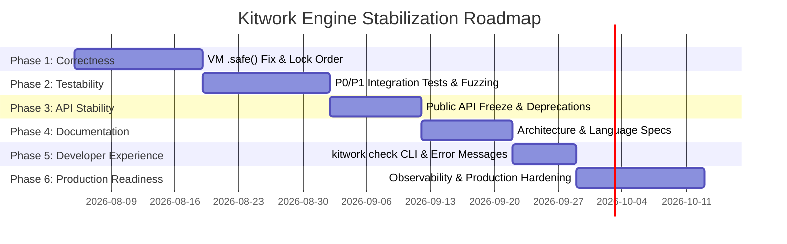

# Kitwork Engine — Stabilization Roadmap

This roadmap outlines a phased, prioritized plan to stabilize the Kitwork Engine, address technical risks, solidify API contracts, expand test coverage, and achieve production readiness.

---

## 1. Roadmap Overview & Phases

---

## 2. Detailed Task Breakdown by Phase

### Phase 1: Correctness & System Invariants (Priority: Critical)
Focuses on fixing confirmed bugs, error propagation gaps, and concurrency risks.

| Task ID | Task Description | Priority | Affected Package | Complexity | Dependencies | Completion Criteria |
|---|---|---|---|---|---|---|
| **1.1** | **Fix VM `.safe()` Execution on Hard Errors**: Enable `.safe()` to execute when stack top is `Value{K: Invalid}` instead of triggering an immediate VM abort. | P0 | `runtime/`, `compiler/`, `value/` | High | None | `TestSafeRescuesVMHardFailure` passes; JS code calling `fail().safe()` returns `{ ok: false, error: ... }`. |
| **1.2** | **Fix Lock Inversion in Host Shutdown**: Move `Tenant.Close()` calls outside `Engine.mu` lock inside `Engine.Close()`. | P0 | `core/` | Medium | None | `go test -race ./core` passes cleanly under high concurrent shutdown stress. |
| **1.3** | **Fix Cast Method Shadowing in `value.Invoke`**: Check map property keys before calling built-in scalar cast methods (`int`, `string`, `json`). | P1 | `value/` | Medium | None | `userMap.Get("int")` returns map property value without executing scalar cast. |
| **1.4** | **Fix `FileCache` Invalidation for Indirect Imports**: Hash SHA-256 fingerprints of all bundled relative native import files into cache key. | P1 | `compiler/`, `site/` | Medium | None | Editing `./lib/utils.js` changes bytecode cache key and triggers re-compilation. |

### Phase 2: Testability & Quality Assurance (Priority: High)
Expands test coverage for concurrency, failure injection, fuzzing, and edge cases.

| Task ID | Task Description | Priority | Affected Package | Complexity | Dependencies | Completion Criteria |
|---|---|---|---|---|---|---|
| **2.1** | **Add P0/P1 Integration Suite**: Implement `TestConcurrentTenantIsolationSoak` and `TestCronSchedulerCrashRecovery`. | P1 | `core/`, `work/` | Medium | Phase 1 | All P0/P1 test cases pass in CI pipeline. |
| **2.2** | **Expand Fuzzing Seeds**: Add fuzz targets for native bundler import resolution and template rendering engine. | P1 | `compiler/`, `render/` | Medium | Phase 1 | `go test -fuzz` runs cleanly for 10 minutes without panics or memory corruption. |
| **2.3** | **Add Invalid Bytecode Verifier Tests**: Hand-craft corrupted instruction streams and test verifier error reporting. | P2 | `runtime/` | Medium | None | `runtime.Verify` returns `VerifyError` for all malformed input seeds. |

### Phase 3: API Stabilization & Freeze (Priority: Medium)
Freezes public API surfaces and formalizes deprecations.

| Task ID | Task Description | Priority | Affected Package | Complexity | Dependencies | Completion Criteria |
|---|---|---|---|---|---|---|
| **3.1** | **Formalize Public vs Internal API**: Document public `import { ... } from "kitwork"` contracts. | P1 | `work/`, `builtins/` | Low | Phase 1 | Public API specification published in `docs/API_SPEC.md`. |
| **3.2** | **Clean Up Deprecated References**: Remove all stale comments referencing `.result()` and deprecate `ctx.render()`. | P2 | `value/`, `work/` | Low | Phase 1 | No stale references remain in codebase or comments. |

### Phase 4: Documentation (Priority: Medium)
Synchronizes documentation with the production codebase.

| Task ID | Task Description | Priority | Affected Package | Complexity | Dependencies | Completion Criteria |
|---|---|---|---|---|---|---|
| **4.1** | **Update Application Architecture Doc**: Reconcile [ARCHITECTURE.md](file:///d:/project/kitwork/engine/docs/ARCHITECTURE.md) with production runtime hierarchy. | P2 | `docs/` | Medium | Phase 3 | `ARCHITECTURE.md` accurately describes `router.kitwork.js` and `page.kitwork.html` filesystem tree. |
| **4.2** | **Publish JS Subset Specification**: Write explicit language spec covering syntax bans, array comma rules, and arrow function requirements. | P2 | `docs/` | Low | Phase 3 | `LANGUAGE_SPEC.md` published. |

### Phase 5: Developer Experience (DX) (Priority: Medium)
Improves tooling, CLI diagnostics, and debugging capabilities.

| Task ID | Task Description | Priority | Affected Package | Complexity | Dependencies | Completion Criteria |
|---|---|---|---|---|---|---|
| **5.1** | **Enhance `kitwork check` Preflight Tool**: Include detailed line/column syntax error snippets in preflight output. | P2 | `core/`, `compiler/` | Low | Phase 4 | `kitwork check` prints precise source code context for parse errors. |
| **5.2** | **Expose Bytecode Disassembler**: Provide CLI subcommand (`kitwork disasm <file.js>`) for inspecting compiled opcodes. | P3 | `cmd/`, `compiler/` | Low | Phase 4 | CLI outputs human-readable opcode disassembled table. |

### Phase 6: Production Readiness & Hardening (Priority: High)
Prepares host runtime for enterprise production deployments.

| Task ID | Task Description | Priority | Affected Package | Complexity | Dependencies | Completion Criteria |
|---|---|---|---|---|---|---|
| **6.1** | **Scheduler Recovery & Durability**: Ensure cron jobs interrupt cleanly on SIGTERM and resume without duplicate runs. | P1 | `work/` | High | Phase 2 | Zero lost or duplicated cron executions after simulated host SIGKILL/SIGTERM. |
| **6.2** | **Production Observability & Metrics**: Expose Prometheus-compatible health metrics (`RuntimeHealthSnapshot`). | P2 | `core/`, `work/` | Medium | Phase 3 | `/health` endpoint exposes instruction throughput, active VM pool count, and memory metrics. |
