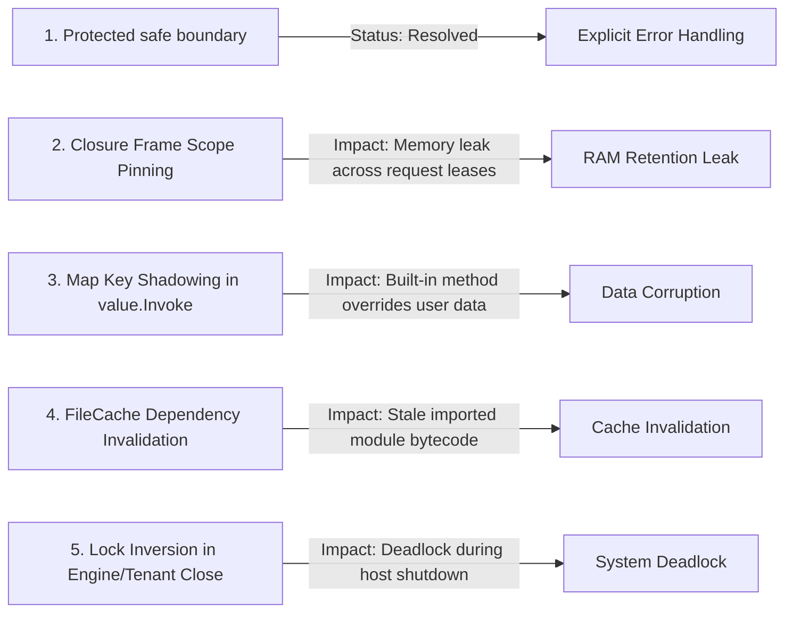

# Kitwork Engine — Technical Risks & Vulnerability Audit

This document identifies high-risk technical areas, potential bugs, resource leaks, and architectural vulnerabilities in the Kitwork Engine codebase.

---

## 1. High-Risk Vulnerability Catalog

---

## 2. Detailed Technical Risk Assessments

### Risk 1: Protected `.safe()` Boundary
- **Severity**: **Resolved; regression-sensitive**
- **Location**: `compiler/compiler.go`, `runtime/interpreter.go`, `runtime/safe_evaluation_test.go`
- **Current Contract**: The compiler wraps only the receiver of zero-argument `X.safe()` in an internal evaluator. Ordinary runtime failures are reshaped, while energy, cancellation, stack overflow, program mismatch and native panic remain fatal.
- **Compatibility**: Compiler schema v3 invalidates stale cache artifacts; VM bytecode v2 and opcode slots are unchanged.

### Risk 2: Scope Memory Pinning in Escaped Closures
- **Severity**: **High** (Confirmed Behavior requiring strict contract)
- **Location**: [engine/runtime/interpreter.go:L173-L192](file:///d:/project/kitwork/engine/runtime/interpreter.go#L173-L192) & [vm.go:L452-L460](file:///d:/project/kitwork/engine/runtime/vm.go#L452-L460)
- **Trigger Condition**: A script creates a closure that captures the frame's `Vars` map (`frame.captured = true`).
- **Impact**: If a long-lived object or global listener stores the closure, the entire `Vars` map of the defining frame remains referenced in memory indefinitely.
- **Proposed Fix**: Enforce static AST variable analysis during compilation to copy only referenced closure variables into a minimal captured environment map instead of retaining the entire frame `Vars` map.

### Risk 3: Cast Method Shadowing in `value.Invoke`
- **Severity**: **High** (Confirmed Risk)
- **Location**: [engine/value/methods.go](file:///d:/project/kitwork/engine/value/methods.go) & [engine/value/kind.go](file:///d:/project/kitwork/engine/value/kind.go)
- **Trigger Condition**: Accessing a property on a map or struct named like a scalar cast method (`int`, `float`, `string`, `json`, `len`).
- **Impact**: `value.Invoke` checks built-in cast methods prior to map key lookup. For example, `userMap.Get("int")` executes the `int()` scalar cast rather than retrieving `userMap["int"]`.
- **Proposed Fix**: Reorder `value.Invoke` to check map key presence before attempting built-in cast method lookup, or scope cast methods under explicit prototype namespaces.

### Risk 4: `FileCache` Invalidation Gap for Indirect Dependencies
- **Severity**: **Medium** (Needs Verification)
- **Location**: [engine/compiler/cache.go](file:///d:/project/kitwork/engine/compiler/cache.go) & [artifact.go](file:///d:/project/kitwork/engine/compiler/artifact.go)
- **Trigger Condition**: A nested imported file (`./lib/utils.js`) is modified on disk, but the top-level router source (`router.kitwork.js`) remains unchanged.
- **Impact**: If the cache key generation misses deeply nested dependency changes during incremental compilation, the engine may load stale bytecode from `.kitwork/cache/bytecode/`.
- **Proposed Fix**: Ensure `FileCache.CacheKey()` recursively hashes the SHA-256 fingerprints of all bundled native import source files.

### Risk 5: Potential Deadlock on `Engine.Close()` vs In-Flight Requests
- **Severity**: **High** (Concurrency Risk)
- **Location**: [engine/core/engine.go:L263-L303](file:///d:/project/kitwork/engine/core/engine.go#L263-L303) & [engine/work/tenant.go:L68-L72](file:///d:/project/kitwork/engine/work/tenant.go#L68-L72)
- **Trigger Condition**: Invoking `Engine.Close()` while requests are currently executing inside `Tenant.Serve`.
- **Impact**: `Engine.Close()` holds `Engine.mu` write lock while iterating over tenants. `Tenant.Close()` waits on `requestWG.Wait()`. If an in-flight request thread attempts to acquire `Engine.mu` (e.g. during site resolution or hot reload check), a mutex deadlock occurs.
- **Proposed Fix**: Collect tenant references under `Engine.mu` read lock, release `Engine.mu`, and then perform asynchronous `Tenant.Close()` drains outside the engine lock.

### Risk 6: Unbounded Energy Consumption in Native Hooks
- **Severity**: **Medium** (Security Risk)
- **Location**: [engine/runtime/vm.go:L27-L31](file:///d:/project/kitwork/engine/runtime/vm.go#L27-L31) (`nativeAction`)
- **Trigger Condition**: A script invokes a native extension method (e.g. complex QR generation, regex matching, or JSON parsing).
- **Impact**: Opcodes consume VM energy (`MaxEnergy`), but execution inside Go native callbacks runs unmetered. A native function running an expensive computation can block the thread without depleting energy bounds.
- **Proposed Fix**: Introduce energy cost estimates for native capability invocations based on payload size or execution duration.

### Risk 7: Background Task Leak on Tenant Eviction
- **Severity**: **Medium** (Resource Leak Risk)
- **Location**: [engine/work/go.go](file:///d:/project/kitwork/engine/work/go.go) & [engine/core/engine.go:L228-L258](file:///d:/project/kitwork/engine/core/engine.go#L228-L258)
- **Trigger Condition**: A script spawns a background task via `kitwork().go(fn)`, and the site tenant is evicted due to idle timeout (`cleanupLoop`).
- **Impact**: `kitwork().go` tasks are owned by `app.Runtime` and continue running after site eviction. However, if the background task attempts to resolve generation-scoped capabilities, it fails or operates on stale resources.
- **Proposed Fix**: Ensure background tasks retain explicit reference count handles on their parent `app.Runtime` resources.
