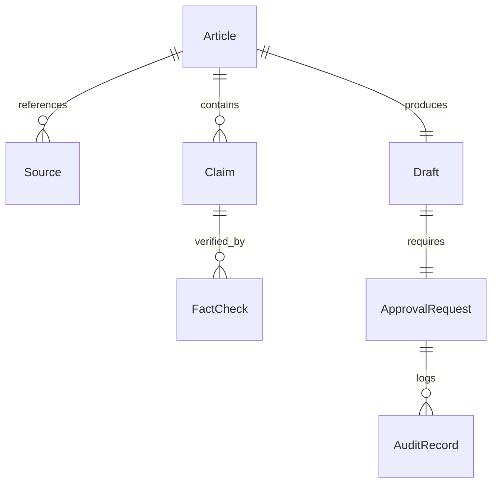

# WithAI Newsroom — Data Model Specification

This document defines the database schemas and relationships for the WithAI Newsroom domain entities.

---

## 1. Entity Relationship Diagram



---

## 2. Table Schemas

### Table 1: `newsroom_articles`
```sql
CREATE TABLE IF NOT EXISTS newsroom_articles (
    id TEXT PRIMARY KEY,
    run_id TEXT NOT NULL,
    title TEXT NOT NULL,
    source_url TEXT NOT NULL,
    source_hash TEXT UNIQUE NOT NULL,
    status TEXT NOT NULL DEFAULT 'drafting', -- drafting, waiting_approval, approved, published, rejected
    created_at TIMESTAMP DEFAULT CURRENT_TIMESTAMP,
    published_at TIMESTAMP
);
```

### Table 2: `newsroom_claims`
```sql
CREATE TABLE IF NOT EXISTS newsroom_claims (
    id TEXT PRIMARY KEY,
    article_id TEXT NOT NULL,
    claim_text TEXT NOT NULL,
    verification_status TEXT NOT NULL, -- verified, unverified, disputed
    confidence_score REAL NOT NULL,
    created_at TIMESTAMP DEFAULT CURRENT_TIMESTAMP,
    FOREIGN KEY(article_id) REFERENCES newsroom_articles(id)
);
```

### Table 3: `newsroom_drafts`
```sql
CREATE TABLE IF NOT EXISTS newsroom_drafts (
    id TEXT PRIMARY KEY,
    article_id TEXT NOT NULL,
    vietnamese_title TEXT NOT NULL,
    vietnamese_body_html TEXT NOT NULL,
    short_x_post TEXT NOT NULL,
    created_at TIMESTAMP DEFAULT CURRENT_TIMESTAMP,
    FOREIGN KEY(article_id) REFERENCES newsroom_articles(id)
);
```

### Table 4: `newsroom_approvals`
```sql
CREATE TABLE IF NOT EXISTS newsroom_approvals (
    id TEXT PRIMARY KEY,
    run_id TEXT NOT NULL,
    article_id TEXT NOT NULL,
    approval_token TEXT UNIQUE NOT NULL,
    status TEXT NOT NULL DEFAULT 'pending', -- pending, approved, rejected
    reviewer_identity TEXT,
    reviewer_notes TEXT,
    requested_at TIMESTAMP DEFAULT CURRENT_TIMESTAMP,
    responded_at TIMESTAMP
);
```
