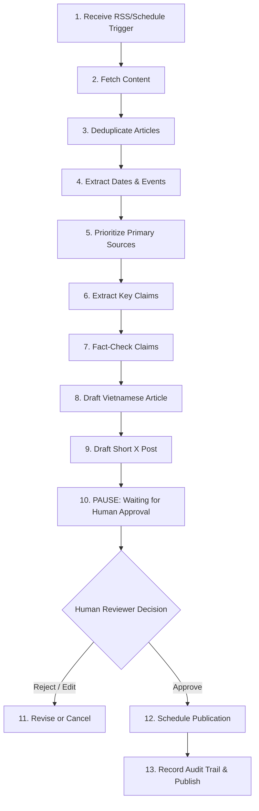

# WithAI Newsroom — Workflow Specification

This document specifies the 13-step automated news gathering, verification, editing, human approval, and publishing workflow for WithAI.vn.

---

## 1. Newsroom Workflow Pipeline

---

## 2. Step-by-Step Workflow Specification

| Step # | Step Name | Executing Skill | Input | Output | Side-Effect Class | Pause for Approval? |
|---|---|---|---|---|---|---|
| **1** | Receive Trigger | `newsroom.cron_trigger` | Cron Schedule / Webhook | `source_url` | `ReadOnly` | No |
| **2** | Fetch Content | `newsroom.fetch_source` | `source_url` | Raw HTML/RSS text | `ReadOnly` | No |
| **3** | Deduplicate | `newsroom.deduplicate` | Raw text | `article_hash`, `is_duplicate` | `ReadOnly` | No |
| **4** | Extract Dates | `newsroom.extract_dates` | Article text | `publish_date`, `event_date` | `ReadOnly` | No |
| **5** | Prioritize Sources | `newsroom.rank_sources` | Article metadata | `source_score`, `is_official` | `ReadOnly` | No |
| **6** | Extract Claims | `newsroom.extract_claims` | Article text | `claims_list[]` | `ReadOnly` | No |
| **7** | Fact-Check Claims | `newsroom.fact_check` | `claims_list[]` | `verification_report` | `ReadOnly` | No |
| **8** | Draft Vietnamese | `newsroom.draft_article` | Verified claims | `draft_vi_html` | `ReversibleWrite` | No |
| **9** | Draft X Post | `newsroom.draft_x_post` | Draft article | `draft_x_text` | `ReversibleWrite` | No |
| **10** | **Human Approval** | `newsroom.human_checkpoint` | Drafts & verification | `approval_token` | `Publication` | **YES (PAUSE RUN)** |
| **11** | Review Decision | `newsroom.process_decision` | `approval_token`, `status` | `decision` | `ReadOnly` | No |
| **12** | Schedule Publish | `newsroom.schedule_publish` | Approved article | `publish_timestamp` | `ReversibleWrite` | No |
| **13** | Publish & Audit | `newsroom.publish_article` | Article payload | `published_url`, `audit_id` | `Publication` | No (Already approved) |
