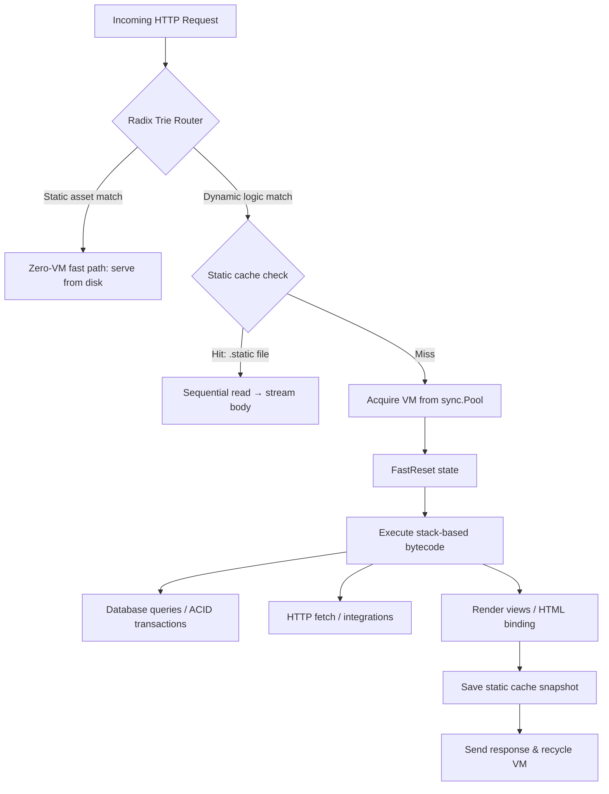

# Kitwork Engine

> **Cloud Infrastructure in a Single Binary — the execution core.**

[](https://golang.org)
[](#license--support)
[](#performance)
[](#performance)

**Kitwork Engine is a multi-tenant cloud runtime written natively in Go.** It compiles a JavaScript dialect into bytecode and executes it on a custom stack-based virtual machine — with energy metering, per-tenant sandboxing, hot reload, an integrated router, a zero-allocation database layer, and a template engine. One binary hosts unlimited domains; deploying a website means dropping a folder.

It is the execution core of [Kitwork](https://kitwork.vn) — a bet that an entire cloud stack (compute, runtime, delivery, scheduling) can collapse into one coherent process instead of a fleet of Redis, Kafka, and Kubernetes.

---

## Table of Contents

- [Why a custom VM?](#why-a-custom-vm)
- [Quick Start](#quick-start)
- [The Language](#the-language-javascript-you-know-bounded-by-design)
- [Multi-Tenant Layout](#multi-tenant-layout)
- [Architecture](#architecture)
- [Security & Sandboxing](#security--sandboxing)
- [Performance](#performance)
- [The Cluster Vision](#the-cluster-vision)
- [FAQ](#faq)
- [Documentation](#documentation)

---

## Why a custom VM?

Running untrusted tenant code is the defining problem of cloud infrastructure. The industry has three answers:

| Approach | Isolation | Cold boot | Binary weight | Can the language hurt the host? |
| :--- | :--- | :--- | :--- | :--- |
| Containers / microVMs | OS-level | 100ms – seconds | image per tenant | Yes — anything goes inside |
| Embedded V8 / goja | interpreter-level | ~ms | heavy (V8) or slow (reflection) | Yes — `while(true)` needs watchdogs |
| **Kitwork VM** | **bytecode-level** | **< 10ms** | **one Go binary** | **No — unbounded constructs do not compile** |

Kitwork chose to own the entire pipeline — lexer, parser, compiler, opcodes, VM — so that safety lives in the *language definition*, not in patches around it. Every instruction is energy-metered. Every workload provably terminates. A tenant cannot harm a node, which is what later allows any node to absorb any tenant.

> The VM core runs at **~14.1 million ops/sec** with **near-zero GC pressure**, because safety did not have to be bolted on — it was compiled in.

---

## Quick Start

### Embedded in your Go application

```bash
go get github.com/kitwork/engine
```

```go
package main

import (
    "log"

    "github.com/kitwork/engine"
)

func main() {
    if err := engine.Run("config.kitwork.yml"); err != nil {
        log.Fatalf("engine startup failed: %v", err)
    }
}
```

### Configuration — one file, environment-aware

```yaml
port: 8080
root: "tenants"          # multi-tenant root directory

domains:                  # automatic HTTPS via ACME
  - kitwork.vn

max_energy: 1000000       # VM energy budget per execution
hot_reload: true          # atomic bytecode swap on file change, <10ms

database:
  type: "postgres"        # PostgreSQL / MySQL
  host: "localhost"
  port: 5432
  user: "postgres"
  password: "${DB_PASSWORD}"   # env vars expand at boot
  name: "postgres"
  max_open: 50
  max_idle: 10
```

### Your first endpoint

```javascript
import { router, database } from "kitwork"

const db = database.connection()

router.get("/api/hello").handle((req, res) => {
    return res.json({
        status: "active",
        time: new Date().toISOString()
    })
})

router.get("/api/users").handle((req, res) => {
    const users = db.table("user").list(10)
    return res.json({ success: true, users: users })
})
```

Save the file. Hot reload recompiles and atomically swaps the bytecode in under 10 milliseconds. No build step, no restart, no toolchain.

---

## The Language: JavaScript you know, bounded by design

Tenant logic is written in a JavaScript dialect. **Everything that is supported behaves exactly like standard JS** — this is an iron rule of the project:

- Operators: `===`, `!==`, ternary `?:`, `%`, `+=` `-=` `*=` `/=`, `++` `--`
- Globals: full `Math`, real `Date` (`Date.now()`, `new Date(ms | string | y,m,d)`, all getters, `toISOString`), `JSON`, `Object.keys/values/entries/assign/fromEntries`, `Number` / `String` / `Boolean` conversion, `parseInt` / `parseFloat`
- Complete String & Array method families, **Unicode-correct**: indices count characters, not bytes — `"Phường".length === 6`, slicing never breaks Vietnamese text
- Arrow functions, template literals, spread, destructuring, multi-parameter lambdas
- Lexical closures at **any nesting depth** — `forEach` inside `forEach` mutating an outer array works exactly as in JS

```javascript
orders.filter(o => o.total > 500000)
      .map(o => ({ id: o.id, vat: (o.total * 0.1).toFixed(0) }))
      .sort((a, b) => b.vat - a.vat)

"Phường Bến Nghé".indexOf("Bến")   // 7 — character index, Unicode-safe
"5".padStart(3, "0")                // "005"
items.reduce((acc, x) => acc + x.qty, 0)
```

### Deliberately removed — this is the product, not a gap

| Removed | Why | Write instead |
| :--- | :--- | :--- |
| `while`, `do` | No unbounded loops on shared compute, ever | `.map()` / `.filter()` / `.find()` / `.forEach()` |
| `try` / `catch` / `throw` | One visible error path, not invisible jumps | `.done(cb)` / `.fail(cb)` |
| `switch` | Smaller language, fewer ways to disagree | `if / else` or object lookup |
| `class` | Data is data; behavior is functions | object literals + arrow functions |

Using a removed keyword produces a compile error that teaches:

```text
assemble error: Kitwork không hỗ trợ vòng lặp 'while' (loại bỏ có chủ đích để
tránh vòng lặp vô tận). Hãy dùng .map() / .filter() / .find() trên mảng dữ liệu.
```

Full language reference: [ENGINE_CAPABILITIES.md](./ENGINE_CAPABILITIES.md)

---

## Multi-Tenant Layout

One process serves unlimited domains, routed by hostname. **A folder is a website:**

```text
tenants/
  └─ <tenant-identity>/
       └─ <domain>/                    e.g. kitdata.vn/
            ├─ app.kitwork.js          routes & logic → compiled to bytecode
            ├─ views/                  pages, layouts, partials, {{ bindings }}
            ├─ static/                 .static() disk-cache snapshots
            └─ assets/                 css, js, media — served on the zero-VM fast path
```

Drop a folder in, point DNS at the node, the domain is live. Each tenant runs in its own VM sandbox with its own energy budget. Deployment is `rsync`; rollback is `git checkout`.

---

## Architecture



### Compilation pipeline — source to bytecode, all in Go

1. **Lex & parse**: a hand-written recursive-descent parser builds the AST. No external parser dependencies.
2. **Bundle**: multi-file ESM (`import` / `export`) is resolved by esbuild at compile time — no Node.js required.
3. **Compile**: the AST is flattened into linear `uint8` opcode sequences plus a constants pool. High-level operations (DB queries, template rendering) get specialized opcodes instead of generic call chains — bytecode stays short.
4. **Execute**: a stack-based VM with constant-time variable access, lexical scope chains, and per-opcode energy accounting.

### The zero-allocation philosophy

- **`sync.Pool` VM recycling** — pre-allocated VMs are reset in place (`FastReset`), never re-allocated per request
- **Sovereign value model** — a custom `value.Value` struct stores primitives directly, avoiding `interface{}` boxing and pointer-chasing
- **Radix trie routing** — O(L) in path segments, independent of endpoint count; parameter (`:id`) and wildcard (`*`) matching without regex
- **Zero-allocation query builder** — SQL compiled in ~230ns, ~20x faster than reflection-based ORMs ([QUERY_BUILDER.md](./QUERY_BUILDER.md))

### `.static()` — disk caching that feeds the kernel

Responses snapshot to a single offset-delimited binary file:

```text
+------------------------+-------------------------------+---------------------+
| 10-byte length header  | JSON metadata (L bytes)       | raw body payload    |
|                        | status, content-type, headers | HTML, JSON, images  |
+------------------------+-------------------------------+---------------------+
```

One open, one sequential read, then `io.Copy` straight to the socket — no `Seek` syscalls, no RAM staging, metadata expiry via OS file ModTime.

---

## Security & Sandboxing

| Layer | Mechanism |
| :--- | :--- |
| **Language** | Unbounded constructs (`while`, recursion bombs) rejected at compile time |
| **Energy budget** | Every opcode carries a weight; execution aborts the instant `max_energy` is exceeded |
| **Stack sentinel** | Call depth > 64 raises a controlled VM error — the Go runtime stack is never at risk |
| **Memory guards** | String builders (`repeat`, `padStart`) hard-capped; one tenant cannot balloon node RAM |
| **Source mapping** | Every instruction maps back to a source line — failures report `app.kitwork.js:L53`, not hex dumps |
| **ACID boundaries** | Script transactions wrap `*sql.Tx` with deferred recovery: any VM error triggers automatic rollback, zero connection leakage |

---

## Performance

Load-tested with `k6` against a single local node ([methodology](./BENCHMARK.md)):

| Metric | Result |
| :--- | :--- |
| VM core throughput | ~14,100,000 ops/s |
| Instruction latency | ~70 ns |
| HTTP throughput | 12,726 req/s |
| Response latency | p50 1.16 ms · avg JSON 90 µs |
| Success rate | 100.00% (0 / 127,292 failed) |
| Cold boot | < 10 ms |
| GC pressure | near zero |

---

## The Cluster Vision

A Kitwork cluster has **no special servers**. Every node runs this same engine; only responsibility differs — Gateway, Coordinator, Worker. Coordination is governed by four falsifiable invariants:

1. **State outlives machines** — the database is the only memory; node RAM holds nothing precious
2. **Correctness never rides the bus** — elections are database leases, not homemade consensus
3. **Lose efficiency before availability** — every role can absorb the role below it
4. **Every workload is bounded** — the language is the cluster's immune system

When Workers die, Coordinators execute. When Coordinators die, Gateways execute. Performance degrades; the system continues.

Full design: [CLUSTER.MD](./CLUSTER.MD)

---

## FAQ

**What is Kitwork Engine?**
A multi-tenant cloud runtime in a single Go binary: it compiles a bounded JavaScript dialect to bytecode and executes it on a custom stack-based VM with energy metering, integrated routing, database access, caching, and templating.

**Is it Node.js-compatible?**
No, deliberately. It is JS-*familiar*: supported syntax behaves exactly like JavaScript, but unbounded constructs (`while`, `try/catch`, `class`) are removed by design and rejected at compile time with instructive errors.

**Why not embed V8 or goja?**
Owning the compiler means safety guarantees (termination, energy budgets, memory caps) are properties of the language itself — not watchdogs around someone else's runtime. It also keeps the binary small and cold boots under 10ms.

**Who is it for?**
SaaS platforms hosting untrusted tenant logic, edge/serverless workloads needing instant cold starts, programmable API gateways, and teams who want cloud capability without operating a Kubernetes estate.

**What databases are supported?**
PostgreSQL and MySQL, through a zero-allocation fluent query builder with ACID transaction support.

**What makes it suited to the Vietnamese market?**
Built-in NAPAS 247 / VietQR-compliant QR generation (SVG, every bank BIN, EMVCo-checked) and Unicode-correct string handling where indices count characters — Vietnamese text never breaks.

**Is it production-ready?**
The engine powers live multi-tenant sites today. The clustering layer ([CLUSTER.MD](./CLUSTER.MD)) is design-complete and being implemented in phases.

---

## Documentation

| Document | Contents |
| :--- | :--- |
| [ENGINE_CAPABILITIES.md](./ENGINE_CAPABILITIES.md) | Language reference: JS compatibility, removed keywords, cache / static / assets, ESM bundling |
| [CLUSTER.MD](./CLUSTER.MD) | Distributed architecture: invariants, roles, degradation ladder, roadmap |
| [QUERY_BUILDER.md](./QUERY_BUILDER.md) | The zero-allocation database layer |
| [BENCHMARK.md](./BENCHMARK.md) | Load-test methodology and raw numbers |

---

## License & Support

Developed by **Huỳnh Nhân Quốc** under the **Kitwork Foundation**. Released under the **Apache 2.0 License**.

> *"While the world is busy using AI to automate everything, I choose to breathe a soul into every line of code. I expose this system to the world simply because it is beautiful, crazy, and dreamy."*

Support development: [Sponsor Kitwork](https://github.com/sponsors/huynhnhanquoc)
