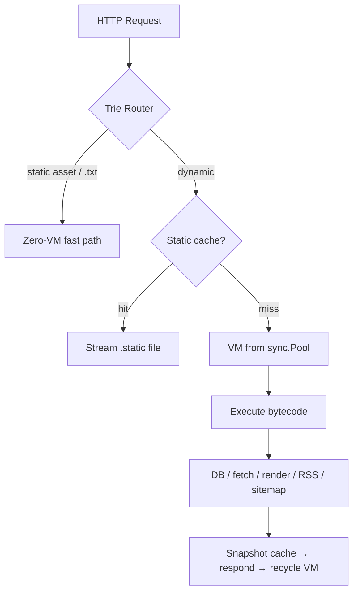

# Kitwork Engine

> **The cloud became an estate to operate. Kitwork is a disagreement.**

[](https://golang.org)
[](#author--license)
[](#performance)
[](#performance)

**Kitwork Engine is cloud infrastructure compiled into a single Go binary.** It runs a JavaScript dialect on a custom stack-based bytecode VM — with energy metering, per-tenant sandboxing, hot reload, an integrated router, a fluent query-builder over SQL, a template engine, automatic TLS, built-in rate limiting, semantic RSS/Sitemap publishing, and SSE streaming. One process hosts unlimited domains. Deploying a website means dropping a folder.

Every system starts simple — then caching brings Redis, queues bring RabbitMQ, orchestration brings Kubernetes, and the team ends up operating machinery instead of shipping product. Kitwork collapses that estate back into **one runtime with one philosophy**: from the language, which cannot loop forever, to the cluster, which degrades instead of dying.

---

## The Contract — five rules

Everything in this repository follows five falsifiable rules. If a feature violates one, the feature is wrong.

1. **What is supported behaves exactly like JavaScript.** No almost. No silent nulls.
2. **What is removed fails at compile time, with an explanation.** Absence is a statement, never a surprise.
3. **Every workload is bounded** — by the language and by per-instruction energy metering.
4. **One binary is the whole platform.** If it needs a second service to work, it doesn't ship.
5. **State outlives machines.** Node RAM holds nothing precious; the database is the only memory.

---

## Why a custom VM?

Running untrusted tenant code is *the* defining problem of cloud infrastructure:

| Approach | Isolation | Cold boot | Footprint | Can tenant code hurt the host? |
| :--- | :--- | :--- | :--- | :--- |
| Containers / microVMs | OS-level | 100ms – seconds | an image per tenant | Yes — anything goes inside |
| Embedded V8 / goja | interpreter-level | ~ms | heavy or slow | Yes — `while(true)` needs watchdogs |
| **Kitwork VM** | **bytecode-level** | **< 10ms** | **one Go binary** | **No — unbounded constructs do not compile** |

Kitwork owns the entire pipeline — lexer, parser, compiler, opcodes, VM — so safety is a property of the **language definition**, not a patch around someone else's runtime. A tenant cannot harm a node; that single guarantee is what later allows any node to absorb any tenant.

---

## Quick Start

```bash
go get github.com/kitwork/engine
```

```go
package main

import (
    "log"

    "github.com/kitwork/engine"
)

func main() {
    // Starts the engine using server.kitwork.js as the bootstrap config
    if err := engine.Run("server.kitwork.js"); err != nil {
        log.Fatal(err)
    }
}
```

**`server.kitwork.js`** — the host bootstrap config using the **Fluent Chainable Builder API**:

```javascript
import { server, env } from "kitwork"

server
  .port(env.PORT || 8080)
  .root(env.ROOT || "tenants")
  .hostname(env.SITE_HOSTNAME || "kitwork.io")
  .hotReload(true)
  .allowLocal(env.ALLOW_LOCAL || false)
  .rateLimit({ rate: 2000, ip: 120, browser: 240, period: "1s" })
  .database({
    alias: "system",
    type: env.DB_TYPE || "postgres",
    host: env.DB_HOST || "localhost",
    port: env.DB_PORT || 5432,
    user: env.DB_USER || "postgres",
    password: env.DB_PASSWORD || "your_password",
    name: env.DB_NAME || "postgres",
    sslmode: "disable"
  })
  .logger({
    level: env.LOG_LEVEL || "info",
    format: env.LOG_FORMAT || "text",
    logfile: "logs/kitwork.log"
  });

// Run server
server.run().catch((err) => console.log("Server error:", err));
```

**`tenants/029w8decto4uabhpsmfjlxgknzqy7356riv1/kitwork.io/router.kitwork.js`** — your tenant application:

```javascript
import { router, database } from "kitwork"

const db = database.connect("system")

router.get("/api/users").handle((req, res) => {
    const users = db.table("user").list(10)
    return res.json({ success: true, users: users, time: new Date().toISOString() })
})
```

Save the tenant file — the engine recompiles and atomically swaps the bytecode in under 10ms. No build step. No restart. No toolchain.

---

## Server Setup & Bootstrap API Reference

The `server` object in the bootstrap configuration script (`server.kitwork.js`) uses a chainable fluent builder to configure host properties:

| Method | Argument Type | Description |
| :--- | :--- | :--- |
| **`.port(v)`** | `Number` / `String` | Sets the server listening port (1 - 65535). |
| **`.root(v)`** | `String` | Multi-tenant directory root path (defaults to `"tenants"`). |
| **`.hostname(v)`** | `String` | The primary hostname of the server engine. |
| **`.hotReload(v)`** | `Boolean` | Enable/disable auto-recompilation on tenant file updates. |
| **`.allowLocal(v)`** | `Boolean` | Bypass AutoSSL/Let's Encrypt certificates (used for offline development). |
| **`.rateLimit(v)`** | `Object` | Sets global server limits: `{ rate, ip, browser, period }`. |
| **`.trustProxy(v)`** | `Boolean` | Rely on `X-Forwarded-For`/`X-Real-IP` HTTP headers. |
| **`.database(v)`** | `Object` | Appends a database client mapping block to the configuration. |
| **`.canonical(v)`** | `String` | Auto-canonical redirects: `"apex"` (www ➔ apex) or `"www"` (apex ➔ www). |
| **`.redirects(v)`** | `Object` | Set permanent static host redirects: `{ "old.com": "new.com" }`. |
| **`.logger(v)`** | `Object` | Configure server logging: `{ level, format, logfile }`. |
| **`.run(port?)`** | `Number?` | Executing the setup configuration and listening. |

---

## The Language (Kit JS Dialect Rules)

To maintain ultra-lightweight execution limits and instant cold starts, the compiler enforces strict language subset constraints. **Failure to follow these rules results in a compile-time error (`assemble error`).**

### 1. Arrow Functions ONLY (No `function` Keyword)
To optimize parser speed and VM footprint, the `function` keyword is completely removed. All functions must be declared using the arrow syntax:
```javascript
// CORRECT
const add = (a, b) => a + b;
export const greet = () => "Hello!";

// WRONG - Will throw a compile-time error:
function add(a, b) { return a + b; }
export function greet() { return "Hello!"; }
```

### 2. Multi-Level Lexical Scope (Closure Capture Chain)
Nested arrow functions capture outer block scopes at **any nesting depth**, obeying JavaScript's standard closure chain behavior:
```javascript
const search = (query) => {
    const results = [];
    keys.forEach((key) => {
        groups[key].forEach((item) => {
            if (item.indexOf(query) != -1) results.push(item); // Read/write results (nested 2 levels)
        });
    });
    return results;
};
```

### 3. Trailing Comma Rules
* **Arrays reject trailing commas:** `const a = [1, 2, 3,];` is a syntax error.
* **Objects allow trailing commas:** `const o = { a: 1, b: 2, };` is valid.

### 4. Arrow Return Object Parentheses
When returning an object literal directly from a single-line arrow function, it must be parenthesized:
```javascript
// CORRECT
const getUser = (id) => ({ id: id, role: "user" });

// WRONG - Will throw a compile-time error:
const getUser = (id) => { id: id, role: "user" };
```

### Deliberately removed — this is the product, not a gap

| Removed | Why | Write instead |
| :--- | :--- | :--- |
| `while`, `do` | No unbounded loops on shared compute, ever | `.map()` / `.filter()` / `.find()` |
| `try` / `catch` / `throw` | One visible error path, not invisible jumps | `.done(cb)` / `.fail(cb)` |
| `switch` | Smaller language, fewer ways to disagree | `if / else` or object lookup |
| `class` | Data is data; behavior is functions | object literals + arrow functions |

---

## Handlers Dynamic Parameter Injection

Kitwork handlers feature **Dynamic Parameter Injection**. Instead of requiring a rigid arguments sequence, the VM examines the parameter *names* declared in your handler arrow functions and injects the corresponding capabilities at runtime:

```javascript
// Sequence does not matter - names drive injection
router.get("/users").handle((res, req) => {
    // res and req are automatically resolved and injected!
});

router.get("/dashboard").handle((ctx) => {
    // Injects the unified Context object
    return ctx.JSON({ ok: true });
});

router.get("/chat").handle((sse) => {
    // Injects the Server-Sent Events broker helper
    sse.connect({ channel: "general" });
});

router.get("/api").catch((err, res) => {
    // Injects the routing error string and Response helper in catch clauses
    return res.status(500).json({ error: err });
});
```

### Available Parameter Names
* `ctx` / `context`: Injects the unified `Context` object.
* `req` / `request`: Injects the `Request` reader.
* `res` / `response`: Injects the `Response` writer.
* `sse`: Injects the `SseHelper` real-time broker.
* `err` / `error` / `e`: Injects the error message (specifically for `.catch` handlers).

---

## Batteries Included: Tenant VM API Reference

### 1. Unified `Context` (API Shortcuts)
The Context object (`ctx` or `context`) wraps the request and response cycles into a clean fluid API:
* **`.json(data, code?)`**: Responds with JSON payload.
* **`.html(html, code?)`**: Responds with HTML payload.
* **`.text(text, code?)`**: Responds with plain text.
* **`.status(code)`**: Explicitly sets response HTTP status.
* **`.redirect(url, code?)`**: Redirects to target location.
* **`.params(key)`**: Retrieves path parameters (e.g. `/users/:id` ➔ `ctx.params("id")`).
* **`.query(key)`**: Retrieves search query parameters (e.g. `?q=text` ➔ `ctx.query("q")`).
* **`.path()` / `.method()` / `.host()` / `.ip()`**: Metadata queries.
* **`.body()` / `.jsonBody()`**: Extracts raw request content or parses JSON payload.
* **`.cookie(name, value?, options?)`**: Unified cookie controller:
  * `ctx.cookie("session")` - Read session.
  * `ctx.cookie("session", token, { httpOnly: true, secure: true })` - Write cookie.
  * `ctx.cookie("session", null)` - Delete cookie.

### 2. Database client (`db` / `database`)
A zero-allocation query builder targeting high-speed SQL output without reflection overhead:
* **`.connect(alias)`**: Connect to configured database name.
* **`.table(name)`** (or dynamic property proxy like `db.user`): Starts a query builder.
* **`.find(id)`**: Primary key lookup.
* **`.first()` / `.last()`**: Fetch limits.
* **`.where(lambda)`**: Compiles Go-native comparisons directly to parameterized SQL:
  * *Simple:* `db.products.where(p => p.price > 500)`
  * *Auto-IN:* `db.user.where(u => u.id == [1, 5, 10])`
  * *Auto-LIKE:* `db.products.where(p => p.name == "Apple%")` (uses `%` wildcard)
* **`.update(data)`**: Updates records matching criteria (Strict Mode: **requires** `.where()`).
* **`.create(data)`**: Inserts a record and returns the created database row.
* **`.delete()` / `.destroy()`**: Soft (sets `deleted_at`) or hard physical removals.

### 3. Outbound Client (`http`)
A cached, persistent HTTP client featuring automatic stale-on-error fallbacks:
```javascript
import { http } from "kitwork"

const response = http
    .cache("5m")         // Store in LRU RAM
    .persist("1d")       // Store in Tenant's sandbox file space
    .header("Authorization", "Bearer token")
    .get("https://api.external.com/data");

if (response.ok) {
    const data = response.json();
}
```
* **Response Methods:** `.json()`, `.text()`, `.base64()` (adds base64 data-URI prefix for images automatically).
* **Response Properties:** `.ok` (boolean), `.status` (HTTP status code), `.error` (error string), `.cached` (RAM/disk hit), `.stale` (served from expired cache due to external service outage).

### 4. Real-time Broker (`sse`)
Go-native Server-Sent Events broker. VM connections are closed within milliseconds of handshaking, offloading the socket to Go goroutines (~4KB RAM footprint) to scale up to millions of connections:
* **`.connect({ channel, maxConnections? })`**: Registers client listener and exits the VM.
* **`.publish(channel, eventPayload)`**: Broadcasts data to all subscribers on a channel.
* **`.send(clientId, eventPayload)`**: Delivers 1-to-1 event to a specific client ID.
* **`.subscribe(clientId, channel)` / `.unsubscribe(...)`**: Dynamically adjusts connection scopes.

### 5. Sandboxed Filesystem (`file`)
Allows reading and writing assets inside the tenant's subdirectory with strict path-traversal boundary limits:
* **`.read(path)`**: Reads file text.
* **`.base64(path)`**: Encodes file contents as data URI.
* **`.write(path, data)` / `.save(path, data)`**: Saves text or base64 decoded binaries (directories are created automatically).

### 6. JSON Web Tokens (`jwt`)
Lightweight token signer and verifier:
* **`.sign(payload, secret, options?)`**: Generates a HS256 JWT. (Options support `{ expiresIn: "2h" }`).
* **`.verify(token, secret)`**: Decodes and verifies token claims.

---

## Dynamic Publishing: Semantic Feeds (RSS & Sitemap)

Kitwork treats RSS and sitemap as semantic outputs, not hand-written XML routes. Provider callbacks run in the tenant VM; escaping, URL normalization, validation, splitting, and serialization run in native Go.

```javascript
import { router } from "kitwork"
import { getPosts } from "./_core/blog.js"

// Serves /sitemap.xml and automatically creates sitemap-N.xml pages above 50,000 URLs.
router.sitemap(() => {
    const posts = getPosts()
    return posts.map(p => ({
        loc: `/blog/${p.slug}`,
        lastmod: p.updated_at,
        changefreq: "weekly",
        priority: "0.8"
    }))
}).cache("6h")

// Serves a valid RSS feed dynamically at /rss.xml
router.rss({
    path: "/feed.xml", // optional; defaults to /rss.xml
    title: "Kitwork Engineering",
    description: "Systems, bytecode, and stack machines",
    link: "https://kitwork.io",
    items: () => {
        return getPosts().map(p => ({
            title: p.title,
            link: `/blog/${p.slug}`,
            description: p.summary,
            published: p.published_at
        }))
    }
}).cache("1h")
```

Generated outputs support the normal method lifecycle (`cache`, `persist`, `limit`, and guards), plus `HEAD`, deterministic `ETag`, `Last-Modified`, and conditional `304` responses. Invalid channel or page data fails with a clear `500` instead of emitting malformed XML.

XML and CSV remain ordinary response representations:

```javascript
router.get((ctx) => ctx
    .type("text/csv; charset=utf-8")
    .send("name,value\nkitwork,1"))
```

See [Publishing outputs](docs/PUBLISHING.md) for the complete contract.

---

## Dynamic UI Layout slots (`@name` slots)

Kitwork HTML templates (`.kitwork.html`) are split into two stages: **Assembly** (resolving layouts and slots) and **Binding** (injecting data).

### Layout Slots
Use the `@name` token syntax inside layout templates to define slots where other views inject content:
```html
<!-- index.kitwork.html (Layout Shell) -->
<html>
  <head>{{ @head }}</head>
  <body>
    <header>{{ @navbar }}</header>
    <main>{{ @page }}</main>
    <aside>{{ @sidebar }}</aside>
    <footer>{{ @footer }}</footer>
  </body>
</html>
```

* **Clean Slot-File Resolution:** A layout slot token like `{{ @sidebar }}` automatically looks for a file named **`sidebar.kitwork.html`** in the local folder. If not found, the search cascadingly walks UP directories until it finds a match or hits the views root folder.
* **Legacy Compatibility:** Legacy syntax `{{ _sidebar_ }}` and filenames prefixed with an underscore (e.g. `_sidebar_.kitwork.html`) are still supported, but clean formatting takes precedence when both exist.
* **Template Syntax:**
  * **Interpolation:** `{{ title }}`, `{{ user.email }}`, `{{ $.siteName }}` (`$.` accesses root scope).
  * **Conditionals:** `{{ if user.is_active }} ... {{ else }} ... {{ end }}`.
  * **Loops:** `{{ for item in items }} ... {{ end }}` or `{{ for (idx, item) in items }} ... {{ end }}`.
  * **Local Variable Assignment:** `{{ let is_admin = user.role == "admin" }}`.

---

## A Folder Is a Website

One process serves unlimited domains, routed by hostname. Layout:

```text
tenants/<identity>/<domain>/      multi-tenant (identity from the system DB)
  ├─ router.kitwork.js   routes, logic & RSS/Sitemap → compiled to bytecode
  ├─ views/              pages, layouts, partials, {{ bindings }}, auto-served .txt
  └─ assets/             served on the zero-VM fast path

tenants/sites/<domain>/           single-tenant — no identity, no DB
```

Drop a folder in, point DNS at the node, the domain is live — each tenant in its own sandbox with its own energy budget. For a `sites/<domain>` folder the Let's Encrypt certificate is issued the moment the folder exists, with zero configuration. Deployment is `rsync`; rollback is `git checkout`.

---

## Core VM Builtin Support

### String Utilities (Unicode-Correct)
String index references target **characters (runes)**, not raw bytes. Slices and indexing will never corrupt multi-byte UTF-8 sequences (like Vietnamese text):
```javascript
"Phường".length                   // 6 (not 8)
"Phường Bến Nghé".indexOf("Bến")  // 7
"hello world".slice(6)            // "world"
"hello".substring(3, 1)           // "el" (auto-swaps parameters like standard JS)
"a-a-a".replace("a", "b")         // "b-a-a" (replaces FIRST occurrence only)
"a-a-a".replaceAll("a", "b")      // "b-b-b"
```

### Array Methods
Both callback-based execution loops and array manipulation methods behave identically to JavaScript:
```javascript
nums.forEach(x => { sum = sum + x; });
nums.some(x => x > 4);
nums.every(x => x > 0);
nums.reduce((acc, x) => acc + x, 0);
[1, [2, [3]]].flat(2);           // [1, 2, 3]

// Typed default sort:
[10, 2].sort();                  // [2, 10] (Kitwork fixes JS string-coercion sort bug)
items.sort((a, b) => b - a);     // custom comparator function
```

### Dates and Mathematics
* **`Date` Support:** `new Date()`, `Date.now()`, `Date.parse()`, `d.getTime()`, `d.toISOString()`, `d.getTimezoneOffset()`, `d.toLocaleDateString()`.
* **`Math` Support:** `Math.PI`, `Math.E`, `Math.abs()`, `Math.floor()`, `Math.round()` (half-up rounding), `Math.min()`, `Math.max()`, `Math.random()`.

---

## Architecture



- **Pipeline**: hand-written recursive-descent parser → native import bundler (multi-file ESM lowered in-engine, no Node.js) → AST flattens to `uint8` opcodes + constants pool → stack-based VM with lexical scope chains and per-opcode energy accounting
- **Zero-allocation discipline**: VMs recycled via `sync.Pool` and reset in place; a custom `value.Value` model avoids `interface{}` boxing; trie routing is O(path segments) with no regex
- **`.cache()` / `.static()`**: thread-safe RAM cache per route, and disk snapshots streamed to the socket with sequential reads — no `Seek`, no RAM staging
- **Query builder**: parameterized SQL compiled in-engine (no reflection-ORM round-trips at request time), with ACID transactions and automatic rollback ([QUERY_BUILDER.md](./QUERY_BUILDER.md))

---

## Security Model

| Layer | Mechanism |
| :--- | :--- |
| Language | Unbounded constructs rejected at compile time |
| Energy budget | Every opcode weighted; execution aborts past `max_energy` |
| Stack sentinel | Call depth > 64 → controlled VM error, never a Go stack overflow |
| Memory guards | String builders hard-capped; no tenant can balloon node RAM |
| Source mapping | Failures report `router.kitwork.js:L53`, not hex dumps |
| ACID boundaries | Any VM error → automatic rollback, zero connection leakage |
| SQL safety | Parameterized queries; update/delete without a `WHERE` is refused |
| Outbound | SSRF guard blocks requests to internal/loopback ranges |
| Rate limiting | Per-IP / user / browser / global, at the server and tenant layers |

### Environment Variable Scoping & Isolation

> [!WARNING]
> Do **NOT** load sensitive global host credentials into the host OS environment variables. The global process environment is accessible only to the host setup VM (`server.kitwork.js`).
>
> To prevent credential leakage in multi-tenant environments, every tenant's VM is strictly isolated: a tenant can only read environment variables loaded from its local `.env` file located inside its tenant directory (e.g. `tenants/<identity>/<domain>/.env`).

---

## Performance

Measured June 2026 on an i7-11850H (8C/16T) — Go microbenchmarks for the VM core ([work/bench_core_test.go](./work/bench_core_test.go)), `k6` for HTTP against a live multi-tenant node:

| Metric | Result |
| :--- | :--- |
| VM core throughput | ~36,500,000 instructions/s |
| Instruction latency | ~27 ns |
| HTTP throughput | 33,287 req/s · 200 concurrent VUs · real tenant route |
| Response latency under that load | p50 3.5 ms · p95 18.8 ms |
| Success rate | 100.00% (0 / 499,510 failed) |
| Cold boot — full tenant (native bundle + compile + routes) | 9.8 ms |
| Cold boot — script pipeline only (lex → parse → compile → run) | 1.7 ms |

---

## The Cluster

No special servers — every node runs this same engine; only responsibility differs (Gateway, Coordinator, Worker):

- **State outlives machines** — the database is the only memory
- **Correctness never rides the bus** — elections are database leases, not homemade consensus
- **Lose efficiency before availability** — when Workers die, Coordinators execute; when Coordinators die, Gateways execute
- **Every workload is bounded** — the language is the cluster's immune system

Performance degrades. The system continues. The clustering layer is **design-complete and being implemented in phases** — full design: [CLUSTER.MD](./CLUSTER.MD), transport backbone: [backbone.md](./backbone.md).

---

## FAQ

**What is Kitwork Engine?**
A multi-tenant cloud runtime in a single Go binary: a bounded JavaScript dialect compiled to bytecode, executed on a custom VM with energy metering, routing, database access, caching, templating, AutoSSL, rate limiting, and SSE streaming built in.

**Is it Node.js-compatible?**
No — deliberately. Supported syntax behaves exactly like JavaScript; unbounded constructs (`while`, `try/catch`, `class`) are removed by design and rejected at compile time with instructive errors. Imports are native — there is no Node.js or bundler in the pipeline.

**Why not embed V8 or goja?**
Owning the compiler makes safety a property of the language itself — not a watchdog around someone else's runtime — and keeps cold boots under 10ms in a small binary.

**Who is it for?**
SaaS platforms hosting untrusted tenant logic, serverless workloads needing instant cold starts, programmable API gateways, and teams who want cloud capability without a Kubernetes estate.

**Is it production-ready?**
The engine powers live multi-tenant sites today, including built-in NAPAS 247 / VietQR payment QR generation for the Vietnamese market. The clustering layer is design-complete and being implemented in phases.

---

## Documentation

| Document | Contents |
| :--- | :--- |
| [ENGINE_CAPABILITIES.md](./ENGINE_CAPABILITIES.md) | Language reference: JS compatibility, removed keywords, cache / static / assets |
| [CLUSTER.MD](./CLUSTER.MD) | Distributed architecture: invariants, roles, degradation, roadmap |
| [backbone.md](./backbone.md) | QUIC-centric transport backbone: planes, invariants, phased roadmap |
| [QUERY_BUILDER.md](./QUERY_BUILDER.md) | The query-builder database layer |
| [BENCHMARK.md](./BENCHMARK.md) | Load-test methodology and raw numbers |

---

## Author & License

Kitwork is written the way one writes an essay — every line argued over, nothing kept that cannot be defended. It is public not because it is finished, but because it is honest: small enough to understand, strange enough to matter, and built to keep running after everything around it fails.

### Dual-Licensing Model

Kitwork Engine is open-source software licensed under the **GNU Affero General Public License (AGPL-3.0)**.

If you wish to use the Kitwork Engine in closed-source proprietary environments or embed it into a commercial product without being bound by the copyleft requirements of the AGPL-3.0, a **Commercial License** is available. For licensing terms and corporate inquiries, contact: [support@kitwork.org](mailto:support@kitwork.org).

**Huỳnh Nhân Quốc** · Kitwork Foundation · AGPL-3.0 & Commercial · [Sponsor](https://github.com/sponsors/huynhnhanquoc)
