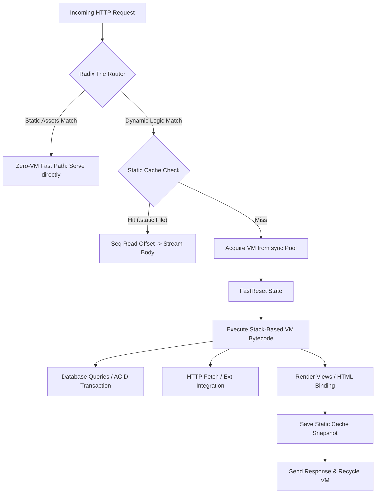

# 🚀 Kitwork Engine
> **High-Performance, Multi-Tenant Sovereign Logic Engine for Go.**

[](https://golang.org)
[](#)
[](#)

Kitwork Engine is an industrial-grade, stack-based bytecode virtual machine and routing infrastructure written natively in Go. It enables SaaS providers and developers to run untrusted, dynamic JavaScript-based routing and workflow logic at native-level speeds. 

By separating the hosting platform (Go) from the tenant business rules (JavaScript Bytecode), Kitwork is ideal for multi-tenant architectures, edge functions, and programmable API gateways.

---

## ⚡ Performance Highlights
* **Core VM Instruction Speed**: ~14.1 Million operations/sec.
* **Logic Execution Latency**: ~70ns per VM instruction clock.
* **Zero-Allocation Query Builder**: 230ns compilation, **20x faster** than GORM, with 0 B/op memory overhead.
* **Zero-Downtime Hot Reloading**: Compiles and atomic-swaps script contexts in `<10ms`.
* **Zero-Allocation Disk Caching**: Streams cached binary payload directly using OS-level file offsets and `io.Copy`.

---

## 📦 Go Quickstart

### 1. Install Dependency
```bash
go get github.com/kitwork/engine
```

### 2. Standard Go Integration
Implement Kitwork in your main entrypoint in just a few lines:

```go
package main

import (
	"log"

	"github.com/kitwork/engine"
)

func main() {
	// Boot the engine server with configuration
	log.Println("Starting Kitwork Logic Engine...")
	if err := engine.Run("config.kitwork.yml"); err != nil {
		log.Fatalf("Server startup failed: %v", err)
	}
}
```

---

## ⚙️ Configuration (`config.kitwork.yml`)
The engine is configured using a YAML/JSON configuration file. Environment variables inside the file are automatically expanded at boot time.

```yaml
# Server Port
port: 8080

# Multi-tenant root directory
root: "tenants"

# List of domains for Auto-HTTPS (ACME)
domains:
  - kitwork.vn

# VM Energy Budget (limits loop iterations and network calls per request)
max_energy: 1000000

# Enables hot reloading of script files on modification
hot_reload: true

# Database connection pool (PostgreSQL / MySQL supported)
database:
  type: "postgres"
  host: "localhost"
  port: 5432
  user: "postgres"
  password: "${DB_PASSWORD}" # Expanded automatically from environment variables
  name: "postgres"
  ssl: "require"
  timeout: 5
  max_open: 50
  max_idle: 10
  lifetime: 12 # Connection max lifetime (minutes)
```

---

## 📂 Multi-Tenant Layout
Kitwork automatically maps incoming host requests to dedicated tenant environments based on the folder structure inside the configured `root` directory:

```
[root]/ (e.g. tenants/)
  └─ [tenant_identity]/ (e.g. test/)
       └─ [domain]/ (e.g. localhost/)
            ├─ app.kitwork.js   <-- Script compiled into Bytecode
            ├─ views/           <-- Sovereign HTML page fragments
            │    └─ page.kitwork.html
            ├─ static/          <-- Hashed disk-based `.static` cache snapshots
            └─ assets/          <-- Direct resource assets (CSS, JS, media)
```
When a request hits `http://localhost:8080`, the engine matches it against `tenants/test/localhost/app.kitwork.js`, compiling the VM bytecode on the fly if not cached.

---

## 🧠 Deep-Dive Architecture & Internals



### 1. Compilation Pipeline (AST to Bytecode)
The compilation pipeline is built entirely in Go without heavy external dependencies:
* **Lexical & Syntactic Analysis**: The Lexer tokens are parsed by a recursive descent parser into an **Abstract Syntax Tree (AST)**.
* **Bytecode Generation**: The Compiler walks the AST and emits flat linear instruction sequences (`[]byte`) alongside a Constants Pool (`[]value.Value`). Opcodes are represented by raw `uint8` instructions.
* **Specialized Opcodes**: Instead of compiling database queries or template rendering into generic nested VM calls, the compiler emits optimized, high-level commands. This keeps bytecode short and avoids execution overhead.

### 2. High-Performance Radix Trie Router
Kitwork replaces linear O(N) route matching with an optimized **Radix Trie** structure:
* **Lookup Complexity**: Route lookup runs in $O(L)$ where $L$ is the number of path segments, making route matching completely independent of the number of registered endpoints.
* **Wildcards and Parameters**: Node nodes support parameter matching (`:id`) and greedy wildcard matching (`*`) without regex overhead.
* **Static Route Maps**: Paths without parameters are stored in a fast lookup map for $O(1)$ near-instant evaluation.

### 3. Micro-Optimizations & The Zero-Allocation Philosophy
To handle ultra-high concurrency (target 50,000 RPS on local loopbacks), Kitwork implements strict garbage collector pressure reduction patterns:
* **`sync.Pool` VM Recycling**: Spawning new virtual machines on every request causes immense heap allocations. Kitwork holds pre-allocated `*runtime.VM` instances in a `sync.Pool`.
* **State FastReset**: Instead of allocating new state frames, recycled VMs are reset instantly via `.FastReset(...)`. It retains slice capacities and overrides instruction and constants pointers in-place.
* **Sovereign Value Model (`value.Value`)**: The VM uses a custom dynamic type struct `value.Value`. It implements internal flags (`Kind`) and stores primitives directly, avoiding standard interface boxing costs (`interface{}`) and pointer tracking overhead.

### 4. Zero-Allocation Disk Caching (`.static()`)
The `.static()` feature uses a single offset-delimited binary format designed to feed the OS kernel efficiently:

```
+------------------------+-------------------------------+-----------------------+
| 10-byte Length Header  |  JSON Metadata (L bytes)      |  Raw Body Payload     |
| (Format: "%010d")      |  - HTTP Code, Content-Type    |  - HTML, Image, JSON  |
+------------------------+-------------------------------+-----------------------+
```
* **Sequential Read Flow**:
  1. Open the `.static` file (1 system call).
  2. Read the first 10 bytes to get length `L`.
  3. Read exactly `L` bytes in-place (`io.ReadFull`) to parse headers and status code.
  4. At this stage, the read pointer is automatically positioned at index `10 + L`.
  5. Call `io.Copy(w, file)` to transfer the remaining body bytes directly to the writer.
* **No `Seek` system calls**: By reading sequentially, the kernel's read pointer advances naturally, avoiding extra system call roundtrips and optimizing file-serving performance.

### 5. Sandboxing & Protection Constraints
* **Energy Budgets**: To prevent infinite loops (`while(true) {}`) from hogging CPU cores, the VM loop evaluates the weight of every opcode execution. Once the energy threshold exceeds `max_energy`, execution is immediately aborted.
* **Stack Depth Sentinel**: Recursion depth is monitored on function calls. Depths beyond 64 trigger a controlled virtual error rather than overflowing the Go runtime stack.
* **Line Number Source Mapping**: During compilation, each instruction pointer is mapped to its file byte offset. If a script fails, the VM runs a binary search against the line-start offsets of the source script, printing a stack trace pointing directly to the exact file line number (e.g. `app.kitwork.js:L53`).

### 6. ACID Transaction Management
Inside the VM, transaction blocks are bounded using Go's native PostgreSQL/MySQL transactions:
* **Callback Isolation**: The engine acquires a transaction boundary `*sql.Tx` and executes the JS lambda inside a deferred recovery block.
* **Automatic Rollback**: If a JavaScript exception is thrown, the Go VM runs into a panic, or the code returns a `value.Invalid` type, the deferred wrapper intercepts it, executes `tx.Rollback()`, and returns the error safely, ensuring zero database connection pool leakage.

---

## ✒️ License & Support
* Developed by **Huỳnh Nhân Quốc** under the **Kitwork Foundation**.