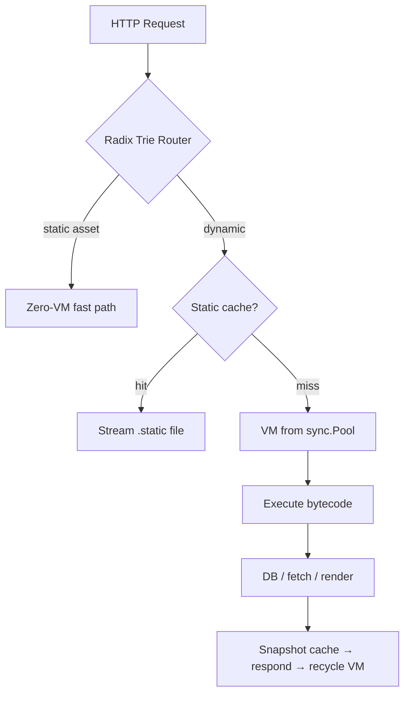

# Kitwork Engine

> **The cloud became an estate to operate. Kitwork is a disagreement.**

[](https://golang.org)
[](#author--license)
[](#performance)
[](#performance)

**Kitwork Engine is cloud infrastructure compiled into a single Go binary.** It runs a JavaScript dialect on a custom stack-based bytecode VM — with energy metering, per-tenant sandboxing, hot reload, an integrated router, a zero-allocation database layer, and a template engine. One process hosts unlimited domains. Deploying a website means dropping a folder.

Every system starts simple — then caching brings Redis, queues bring RabbitMQ, orchestration brings Kubernetes, and the team ends up operating machinery instead of shipping product. Kitwork collapses that estate back into **one runtime with one philosophy**: from the language, which cannot loop forever, to the cluster, which degrades instead of dying.

---

## The Contract — five rules

Everything in this repository follows five falsifiable rules. If a feature violates one, the feature is wrong.

1. **What is supported behaves exactly like JavaScript.** No almost. No silent nulls.
2. **What is removed fails at compile time, with an explanation.** Absence is a statement, never a surprise.
3. **Every workload is bounded** — by the language and by per-instruction energy metering.
4. **One binary is the whole platform.** If it needs a second service to work, it doesn't ship.
5. **State outlives machines.** Node RAM holds nothing precious; the database is the only memory.

---

## Why a custom VM?

Running untrusted tenant code is *the* defining problem of cloud infrastructure:

| Approach | Isolation | Cold boot | Footprint | Can tenant code hurt the host? |
| :--- | :--- | :--- | :--- | :--- |
| Containers / microVMs | OS-level | 100ms – seconds | an image per tenant | Yes — anything goes inside |
| Embedded V8 / goja | interpreter-level | ~ms | heavy or slow | Yes — `while(true)` needs watchdogs |
| **Kitwork VM** | **bytecode-level** | **< 10ms** | **one Go binary** | **No — unbounded constructs do not compile** |

Kitwork owns the entire pipeline — lexer, parser, compiler, opcodes, VM — so safety is a property of the **language definition**, not a patch around someone else's runtime. A tenant cannot harm a node; that single guarantee is what later allows any node to absorb any tenant.

---

## Quick Start

```bash
go get github.com/kitwork/engine
```

```go
package main

import (
    "log"

    "github.com/kitwork/engine"
)

func main() {
    // Starts the engine using server.kitwork.js as the bootstrap config
    if err := engine.Run("server.kitwork.js"); err != nil {
        log.Fatal(err)
    }
}
```

**`server.kitwork.js`** — the bootstrap config (run once on startup):

```javascript
import { server, env } from "kitwork"

server.run({
  port: env.PORT || 8080,
  root: env.ROOT || "tenants",            // multi-tenant root folder
  hostname: "kitwork.io",
  hot_reload: true,
  databases: [
    {
      alias: "system",
      type: "postgres",
      host: env.DB_HOST || "localhost",
      port: env.DB_PORT || 5432,
      user: env.DB_USER || "postgres",
      password: env.DB_PASSWORD || "your_password",
      name: env.DB_NAME || "postgres",
      sslmode: "disable"
    }
  ]
})
```

**`tenants/029w8decto4uabhpsmfjlxgknzqy7356riv1/kitwork.io/app.kitwork.js`** — your tenant application:

```javascript
import { router, database } from "kitwork"

const db = database.connection()

router.get("/api/users").handle((req, res) => {
    const users = db.table("user").list(10)
    return res.json({ success: true, users: users, time: new Date().toISOString() })
})
```

Save the tenant file — the engine recompiles and atomically swaps the bytecode in under 10ms. No build step. No restart. No toolchain.

---

## The Language: JavaScript you know, bounded by design

Rule 1 governs everything supported: **it behaves exactly like standard JS.** Full operator set (`===`, `?:`, `%`, `+=`, `++`), real `Date` and `Math`, `Object.keys/values/entries/assign`, `Number`/`String`/`Boolean` conversion, complete String & Array method families, closures at any nesting depth — and **Unicode-correct strings** where indices count characters, so Vietnamese text never breaks:

```javascript
orders.filter(o => o.total > 500000)
      .map(o => ({ id: o.id, vat: (o.total * 0.1).toFixed(0) }))
      .sort((a, b) => b.vat - a.vat)

"Phường Bến Nghé".indexOf("Bến")   // 7 — character index, Unicode-safe
```

### Deliberately removed — this is the product, not a gap

| Removed | Why | Write instead |
| :--- | :--- | :--- |
| `while`, `do` | No unbounded loops on shared compute, ever | `.map()` / `.filter()` / `.find()` |
| `try` / `catch` / `throw` | One visible error path, not invisible jumps | `.done(cb)` / `.fail(cb)` |
| `switch` | Smaller language, fewer ways to disagree | `if / else` or object lookup |
| `class` | Data is data; behavior is functions | object literals + arrow functions |

Per Rule 2, a removed keyword produces a compile error that teaches:

```text
assemble error: Kitwork không hỗ trợ vòng lặp 'while' (loại bỏ có chủ đích để
tránh vòng lặp vô tận). Hãy dùng .map() / .filter() / .find() trên mảng dữ liệu.
```

It is the same trade Starlark, CEL, and eBPF made: on shared infrastructure, **provable termination is worth more than expressive power**. Kitwork makes the trade in a syntax millions already know.

Full reference: [ENGINE_CAPABILITIES.md](./ENGINE_CAPABILITIES.md)

---

## A Folder Is a Website

One process serves unlimited domains, routed by hostname:

```text
tenants/<identity>/<domain>/
  ├─ app.kitwork.js      routes & logic → compiled to bytecode
  ├─ views/              pages, layouts, partials, {{ bindings }}
  └─ assets/             served on the zero-VM fast path
```

Drop a folder in, point DNS at the node, the domain is live — each tenant in its own sandbox with its own energy budget. Deployment is `rsync`; rollback is `git checkout`.

---

## Architecture



- **Pipeline**: hand-written recursive-descent parser → esbuild bundles multi-file ESM (no Node.js) → AST flattens to `uint8` opcodes + constants pool → stack-based VM with lexical scope chains and per-opcode energy accounting
- **Zero-allocation discipline**: VMs recycled via `sync.Pool` and reset in place; a custom `value.Value` model avoids `interface{}` boxing; radix-trie routing is O(path segments) with no regex
- **`.cache()` / `.static()`**: thread-safe RAM cache per route, and disk snapshots streamed to the socket with sequential reads — no `Seek`, no RAM staging
- **Query builder**: SQL compiled in ~230ns, ~20x faster than reflection ORMs, ACID transactions with automatic rollback ([QUERY_BUILDER.md](./QUERY_BUILDER.md))

---

## Security Model

| Layer | Mechanism |
| :--- | :--- |
| Language | Unbounded constructs rejected at compile time |
| Energy budget | Every opcode weighted; execution aborts past `max_energy` |
| Stack sentinel | Call depth > 64 → controlled VM error, never a Go stack overflow |
| Memory guards | String builders hard-capped; no tenant can balloon node RAM |
| Source mapping | Failures report `app.kitwork.js:L53`, not hex dumps |
| ACID boundaries | Any VM error → automatic rollback, zero connection leakage |

### Environment Variable Scoping & Isolation

> [!WARNING]
> Do **NOT** load sensitive global host credentials into the host OS environment variables. The global process environment is accessible only to the host setup VM (`server.kitwork.js`).
>
> To prevent credential leakage in multi-tenant environments, every tenant's VM is strictly isolated: a tenant can only read environment variables loaded from its local `.env` file located inside its tenant directory (e.g. `tenants/<identity>/<domain>/.env`).

---

## Performance

Measured June 2026 on an i7-11850H (8C/16T) — Go microbenchmarks for the VM core ([work/bench_core_test.go](./work/bench_core_test.go)), `k6` for HTTP against a live multi-tenant node ([methodology](./BENCHMARK.md)):

| Metric | Result |
| :--- | :--- |
| VM core throughput | ~36,500,000 instructions/s |
| Instruction latency | ~27 ns |
| HTTP throughput | 33,287 req/s · 200 concurrent VUs · real tenant route |
| Response latency under that load | p50 3.5 ms · p95 18.8 ms |
| Success rate | 100.00% (0 / 499,510 failed) |
| Cold boot — full tenant (esbuild bundle + compile + routes) | 9.8 ms |
| Cold boot — script pipeline only (lex → parse → compile → run) | 1.7 ms |

Reproduce: `go test ./work/ -bench "VMCoreOps|ColdBoot" -run xxx` and `k6 run k6_test.js`.

---

## The Cluster

No special servers — every node runs this same engine; only responsibility differs (Gateway, Coordinator, Worker):

- **State outlives machines** — the database is the only memory
- **Correctness never rides the bus** — elections are database leases, not homemade consensus
- **Lose efficiency before availability** — when Workers die, Coordinators execute; when Coordinators die, Gateways execute
- **Every workload is bounded** — the language is the cluster's immune system

Performance degrades. The system continues. Full design: [CLUSTER.MD](./CLUSTER.MD)

---

## FAQ

**What is Kitwork Engine?**
A multi-tenant cloud runtime in a single Go binary: a bounded JavaScript dialect compiled to bytecode, executed on a custom VM with energy metering, routing, database access, caching, and templating built in.

**Is it Node.js-compatible?**
No — deliberately. Supported syntax behaves exactly like JavaScript; unbounded constructs (`while`, `try/catch`, `class`) are removed by design and rejected at compile time with instructive errors.

**Why not embed V8 or goja?**
Owning the compiler makes safety a property of the language itself — not a watchdog around someone else's runtime — and keeps cold boots under 10ms in a small binary.

**Who is it for?**
SaaS platforms hosting untrusted tenant logic, serverless workloads needing instant cold starts, programmable API gateways, and teams who want cloud capability without a Kubernetes estate.

**Is it production-ready?**
The engine powers live multi-tenant sites today, including built-in NAPAS 247 / VietQR payment QR generation for the Vietnamese market. The clustering layer is design-complete and being implemented in phases.

---

## Documentation

| Document | Contents |
| :--- | :--- |
| [ENGINE_CAPABILITIES.md](./ENGINE_CAPABILITIES.md) | Language reference: JS compatibility, removed keywords, cache / static / assets |
| [CLUSTER.MD](./CLUSTER.MD) | Distributed architecture: invariants, roles, degradation, roadmap |
| [QUERY_BUILDER.md](./QUERY_BUILDER.md) | The zero-allocation database layer |
| [BENCHMARK.md](./BENCHMARK.md) | Load-test methodology and raw numbers |

---

## Author & License

> *"Logic is the soul of machines. Emotion creates civilization."*

Kitwork is written the way one writes an essay — every line argued over, nothing kept that cannot be defended. It is public not because it is finished, but because it is honest: small enough to understand, strange enough to matter, and built to keep running after everything around it fails.

### Dual-Licensing Model

Kitwork Engine is open-source software licensed under the **GNU Affero General Public License (AGPL-3.0)**.

If you wish to use the Kitwork Engine in closed-source proprietary environments or embed it into a commercial product without being bound by the copyleft requirements of the AGPL-3.0, a **Commercial License** is available. For licensing terms and corporate inquiries, contact: [support@kitwork.org](mailto:support@kitwork.org).

**Huỳnh Nhân Quốc** · Kitwork Foundation · AGPL-3.0 & Commercial · [Sponsor](https://github.com/sponsors/huynhnhanquoc)
